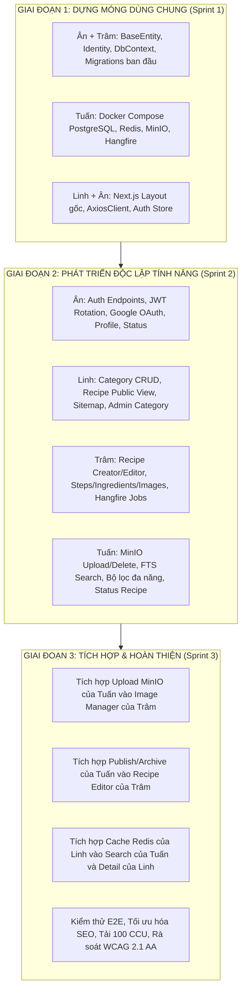

# BẢNG PHÂN CÔNG VÀ MÔ TẢ CHI TIẾT CÔNG VIỆC DỰ ÁN CULINARY BLOG
**Dự án:** Culinary Blog – Nền tảng Chia sẻ Công thức Ẩm thực và Nấu ăn (Nhóm 5)  
**Tài liệu căn cứ kỹ thuật:**  
- `docx/Spec/Culinary_Blog_Spec.md` (Đặc tả Nghiệp vụ & Kiến trúc Chuẩn hóa v1.1.0)  
- `docx/Spec/struc.md` (Báo cáo Phân tích Kiến trúc & Danh mục Mã nguồn Backend/Frontend)  
- `docx/Spec/Frontend_Spec.md` (Đặc tả Giao diện Next.js 16 App Router)  
- `docx/SRS_Culinary_Blog_v1.0.0.pdf` (SRS gốc)  
**Ngày cập nhật:** 2026-09-21  
**Phạm vi áp dụng:** Toàn bộ 4 thành viên trong nhóm (Ân, Linh, Tuấn, Trâm) thực hiện mô hình Full-stack theo chiều dọc tính năng (Feature-driven Full-stack).

---

## MỤC LỤC
1. [Tổng quan Mô hình Phân chia Trách nhiệm](#1-tổng-quan-mô-hình-phân-chia-trách-nhiệm)
2. [Bảng Ma trận Phân công Trách nhiệm Tổng thể](#2-bảng-ma-trận-phân-công-trách-nhiệm-tổng-thể)
3. [Chi tiết Công việc Thành viên 1: Ân](#3-chi-tiết-công-việc-thành-viên-1-ân)
4. [Chi tiết Công việc Thành viên 2: Linh](#4-chi-tiết-công-việc-thành-viên-2-linh)
5. [Chi tiết Công việc Thành viên 3: Tuấn](#5-chi-tiết-công-việc-thành-viên-3-tuấn)
6. [Chi tiết Công việc Thành viên 4: Trâm](#6-chi-tiết-công-việc-thành-viên-4-trâm)
7. [Quy hoạch Nền tảng Dùng chung (Core Foundation)](#7-quy-hoạch-nền-tảng-dùng-chung-core-foundation)
8. [Ma trận Phụ thuộc & Quy trình Phối hợp (Collaboration Workflow)](#8-ma-trận-phụ-thuộc--quy-trình-phối-hợp-collaboration-workflow)

---

## 1. Tổng quan Mô hình Phân chia Trách nhiệm

Dự án áp dụng mô hình **Phân chia theo luồng chức năng End-to-End (Vertical Slicing)**:
- Mỗi thành viên phụ trách trọn vẹn cụm chức năng được giao từ tầng **Database (EF Core Configuration / Migration) ➔ Application (MediatR CQRS, Validators) ➔ Presentation API (Minimal API Endpoints) ➔ Frontend (Next.js Pages, Components, State Store, API Services)**.
- Đảm bảo tính đóng gói cao, giảm thiểu tối đa sự phụ thuộc chéo và xung đột mã nguồn (merge conflicts) trên Git.
- Tất cả các thành viên tuân thủ nghiêm ngặt chuẩn kiến trúc Clean Architecture (.NET 10) ở Backend và Next.js 16 App Router (TypeScript, Tailwind CSS v4, TanStack Query v5, Zustand, Zod) ở Frontend.

---

## 2. Bảng Ma trận Phân công Trách nhiệm Tổng thể

| STT | Thành viên | Nhóm Chức Năng (FR Codes) | Phân hệ Nghiệp vụ Chính | Phạm vi Backend Phụ Trách | Phạm vi Frontend Phụ Trách |
| :---: | :--- | :--- | :--- | :--- | :--- |
| **1** | **Ân** | `FR-AUTH-001` đến `007`<br>`FR-OBS-001` | **Xác thực, Phân quyền, Quản lý Token & Sức khỏe Hệ thống** | • ASP.NET Core Identity & JWT Service<br>• Refresh Token Rotation & Cookie httpOnly<br>• Endpoints `/api/v1/auth/*`<br>• Endpoints Health Check `/health/*`<br>• GlobalExceptionMiddleware (RFC 7807) | • Trang Login, Register, Profile, Status<br>• `LoginForm`, `RegisterForm`, `UserNav`<br>• `GoogleLoginButton`<br>• Zustand `authStore.ts`, hook `useAuth`<br>• Axios Interceptor tự động Refresh Token |
| **2** | **Linh** | `FR-CAT-001` đến `005`<br>`FR-RCP-001`, `002`<br>`FR-JOB-003` | **Khám phá Công cộng, Danh mục, Chi tiết Công thức SEO & Sitemap** | • CRUD Danh mục (`/categories/*`)<br>• Xem công thức công cộng (`/recipes`, `/recipes/{slug}`)<br>• Cấu hình Redis Output Cache cho GET<br>• Sinh Dynamic XML Sitemap | • Trang Landing `/`, Danh mục, Chi tiết món ăn<br>• Trang Admin Danh mục (`/dashboard/categories`)<br>• `RecipeHero`, `IngredientList`, `StepByStepList`<br>• `NutritionCard`, `RecipeTimer`<br>• Schema.org Recipe JSON-LD, Open Graph |
| **3** | **Tuấn** | `FR-SRCH-001` đến `004`<br>`FR-FILE-001`, `002`<br>`FR-OBS-002`, `003`<br>`FR-RCP-005`, `006`<br>`FR-JOB-004` *(Bổ sung)* | **Tìm kiếm FTS, Hạ tầng Tệp MinIO, Vòng đời Bài viết & Vận hành** | • FTS tiếng Việt `tsvector` + `unaccent`<br>• Lọc AND, Sắp xếp, Phân trang `PagedResult`<br>• Dịch vụ MinIO S3 (`IFileStorageService`)<br>• Workflow Xuất bản / Lưu trữ / Khôi phục bài<br>• Serilog Structured Logging & Tracing<br>• Hangfire `PurgeDeletedRecipesJob` (30 ngày) | • Trang Tìm kiếm FTS & Lọc nâng cao `/search`<br>• Trang Quản lý bài viết `/dashboard/recipes`<br>• Component kéo thả MinIO `FileUploadDropzone`<br>• Modal Xuất bản / Lưu trữ / Khôi phục<br>• `SearchInput` (Debounce 400ms), Client Logger |
| **4** | **Trâm** | `FR-RCP-003`, `004`, `007`<br>`FR-RCP-008`, `009`, `010`<br>`FR-JOB-001`, `002` | **Biên soạn Công thức, Quản lý Dữ liệu Con (Ảnh/Nguyên liệu/Bước) & Xử lý Nền** | • Tạo/Sửa Recipe cơ bản & Optimistic Concurrency<br>• Endpoint riêng Cập nhật Dinh dưỡng 6 chỉ số<br>• Soft Delete Recipe (Giai đoạn 1)<br>• Quản lý Ảnh (Primary), Nguyên liệu, Các bước<br>• Endpoint an toàn Đổi thứ tự bước (`/reorder`)<br>• Hangfire Resize Ảnh & Email Chào mừng | • Trình tạo mới `/dashboard/recipes/new`<br>• Trình sửa bài `/dashboard/recipes/[id]/edit`<br>• `RecipeForm` điều phối chính với Zod<br>• `IngredientManager`, `StepManager`<br>• `ImageGalleryManager`, `DeleteRecipeModal`<br>• Trang/Banner Chào mừng `/auth/welcome` |

---

## 3. Chi tiết Công việc Thành viên 1: Ân

### 3.1. Danh mục Mã chức năng Phụ trách
- `FR-AUTH-001`: Đăng ký tài khoản người dùng (Register)
- `FR-AUTH-002`: Đăng nhập bằng Email và Mật khẩu (Local Login)
- `FR-AUTH-003`: Đăng nhập bằng Google OAuth 2.0 (Google Login)
- `FR-AUTH-004`: Làm mới Access Token (Silent Token Refresh)
- `FR-AUTH-005`: Đăng xuất (Logout)
- `FR-AUTH-006`: Xem thông tin hồ sơ cá nhân (User Profile)
- `FR-AUTH-007`: Cập nhật hồ sơ cá nhân & Đổi mật khẩu
- `FR-OBS-001`: Giám sát sức khỏe hệ thống (Health Check Endpoints)

---

### 3.2. Nhiệm vụ Backend (.NET 10 Minimal APIs)
1. **Quản trị Tài khoản & Phân quyền Identity:**
   - Cấu hình entity `ApplicationUser` kế thừa `IdentityUser<string>`: bổ sung các trường `DisplayName`, `AvatarUrl`, `Bio`, `IsActive`, `CreatedAt`.
   - Cấu hình ASP.NET Core Identity: băm mật khẩu PBKDF2 (HMAC-SHA512, $\ge 100.000$ iterations).
   - Thiết lập mặc định: Người dùng đăng ký mới luôn nhận Role `Author`. Role `Admin` chỉ cấp qua seed database.
   - Định nghĩa các Authorization Policies: `AuthorPolicy`, `AdminPolicy`, `VerifiedAuthorPolicy`.
2. **Cơ chế Token An toàn (JWT + Refresh Token Rotation):**
   - Hiện thực `IJwtService` / `JwtService`:
     - Access Token: Ký HMAC-SHA256, thời hạn 15 phút, chứa claims: `userId`, `email`, `roles`, `jti`.
     - Refresh Token: Sinh chuỗi ngẫu nhiên 128-bit cryptographically secure, băm SHA-256 trước khi lưu bảng `RefreshTokens`, thời hạn 7 ngày.
     - **Lưu trữ Cookie:** Thiết lập trả Refresh Token về client qua **httpOnly, Secure, SameSite=Lax Cookie** để triệt tiêu nguy cơ tấn công XSS.
     - **Reuse Detection:** Khi Refresh Token được dùng, thu hồi (revoke) token cũ và cấp token mới. Nếu phát hiện token đã bị thu hồi trước đó gửi lại (dấu hiệu replay attack), lập tức thu hồi toàn bộ Token Family của tài khoản đó.
3. **Google OAuth 2.0 Integration:**
   - Tiếp nhận `idToken` từ frontend gửi lên `POST /api/v1/auth/google`.
   - Sử dụng thư viện `Google.Apis.Auth.GoogleJsonWebSignature` để xác thực token phía backend. Tự động liên kết hoặc tạo tài khoản mới với role Author.
4. **Hệ thống Health Check (`FR-OBS-001`):**
   - Hiện thực `HealthEndpoints.cs` tích hợp gói `AspNetCore.HealthChecks`:
     - `GET /health`: Kiểm tra sức khỏe toàn diện (PostgreSQL, Redis, MinIO).
     - `GET /health/live`: Liveness probe phục vụ container orchestrator (luôn trả 200 nếu web server còn sống).
     - `GET /health/ready`: Readiness probe (kiểm tra CSDL và Redis sẵn sàng tiếp nhận traffic).
5. **Global Error Handling:**
   - Xây dựng `GlobalExceptionMiddleware.cs` chuẩn hóa mọi phản hồi lỗi theo tiêu chuẩn **RFC 7807 Problem Details** (`application/problem+json`).
6. **Danh sách API Endpoints:**
   - `POST /api/v1/auth/register` (Public)
   - `POST /api/v1/auth/login` (Public)
   - `POST /api/v1/auth/google` (Public)
   - `POST /api/v1/auth/refresh` (Public)
   - `POST /api/v1/auth/logout` (Author/Admin)
   - `GET /api/v1/auth/me` (Author/Admin)
   - `PATCH /api/v1/auth/me` (Author/Admin)
   - `GET /health`, `GET /health/live`, `GET /health/ready` (Public/Probes)

---

### 3.3. Nhiệm vụ Frontend (Next.js 16 App Router)
1. **Các trang (Pages):**
   - `app/(auth)/login/page.tsx`: Màn hình đăng nhập Email/Password + nút Google Sign-In, hỗ trợ redirect `callbackUrl`.
   - `app/(auth)/register/page.tsx`: Màn hình đăng ký thành viên mới với kiểm tra độ mạnh mật khẩu theo thời gian thực.
   - `app/(public)/profile/page.tsx`: Trang thông tin cá nhân, chỉnh sửa DisplayName, Bio, thay avatar và form đổi mật khẩu.
   - `app/(public)/status/page.tsx`: Trang theo dõi tình trạng hoạt động và độ trễ phản hồi của hệ thống.
2. **Các thành phần giao diện (Components):**
   - `components/auth/LoginForm.tsx`: Form đăng nhập kết hợp `react-hook-form` và `zod`.
   - `components/auth/RegisterForm.tsx`: Form đăng ký validation chặt chẽ.
   - `components/auth/GoogleLoginButton.tsx`: Nút đăng nhập Google tích hợp Google Identity Services (GIS).
   - `components/layout/UserNav.tsx`: Dropdown menu hiển thị Avatar, tên người dùng, nút chuyển vào Dashboard/Profile và nút Đăng xuất.
   - `components/common/SystemStatusIndicator.tsx`: Widget huy hiệu hiển thị trạng thái kết nối máy chủ.
3. **Quản lý Trạng thái & Dịch vụ (Store & Lib):**
   - `store/authStore.ts`: Zustand Store quản lý trạng thái phiên toàn cục (`user`, `accessToken`, `isAuthenticated`, `login`, `logout`).
   - `hooks/useAuth.ts`: Custom hook tiện ích kiểm tra đăng nhập và phân quyền (`isAuthor`, `isAdmin`).
   - `lib/api/authApi.ts`: Module gọi toàn bộ API xác thực.
   - `lib/api/axiosClient.ts`: Cài đặt **Response Interceptor** tự động phát hiện mã lỗi 401, tạm dừng các request đang chờ để gọi âm thầm endpoint refresh token (`POST /auth/refresh`), sau đó retry lại request ban đầu một cách liền mạch.

---

### 3.4. Tiêu chí Hoàn thành & Nghiệm thu (Acceptance Criteria)
- [ ] Đăng ký tài khoản thành công tự động đăng nhập hoặc điều hướng hợp lý; mật khẩu mã hóa an toàn.
- [ ] Đăng nhập Google qua One Tap / Google Button hoạt động trơn tru; tự động liên kết tài khoản.
- [ ] Refresh token xoay vòng (rotation) ngầm thành công khi access token hết hạn mà không làm gián đoạn thao tác người dùng.
- [ ] Phát hiện sử dụng lại token cũ (replay attack) thì toàn bộ phiên đăng nhập của tài khoản bị hủy ngay lập tức.
- [ ] Đăng xuất xóa sạch access token trong bộ nhớ và xóa httpOnly cookie trên trình duyệt.
- [ ] Liveness probe và Readiness probe phản hồi chính xác trạng thái của CSDL và Redis.

---

## 4. Chi tiết Công việc Thành viên 2: Linh

### 4.1. Danh mục Mã chức năng Phụ trách
- `FR-CAT-001`: Xem danh sách danh mục món ăn (Public Category List)
- `FR-CAT-002`: Xem chi tiết danh mục và công thức thuộc danh mục (Category Detail & Recipes)
- `FR-CAT-003`: Tạo danh mục mới (Admin Category Creation)
- `FR-CAT-004`: Cập nhật thông tin danh mục (Admin Category Update)
- `FR-CAT-005`: Xóa danh mục kèm cơ chế bảo vệ toàn vẹn (Admin Category Deletion)
- `FR-RCP-001`: Khám phá danh sách công thức công cộng (Public Recipe Exploration)
- `FR-RCP-002`: Xem chi tiết công thức nấu ăn chuẩn SEO (Public Recipe Details)
- `FR-JOB-003`: Dynamic XML Sitemap Generation Job (Tối ưu hóa SEO Google Bot)

---

### 4.2. Nhiệm vụ Backend (.NET 10 Minimal APIs)
1. **Module Danh mục (Categories):**
   - Cấu hình bảng `Categories` bằng Fluent API: Khóa chính UUID, `Name` (max 100), `Slug` (max 120, Unique Filtered Index `WHERE "IsDeleted" = false`), `Description`, `ImageUrl`, `OrderIndex`, `RowVersion`.
   - Xây dựng `ICategoryRepository` và `CategoryRepository`:
     - Truy vấn danh sách danh mục kèm số lượng bài viết đã xuất bản (`RecipeCount`).
     - Tìm kiếm theo slug danh mục.
   - CQRS Use Cases:
     - `GetCategoriesQuery`: Đọc danh mục, tích hợp Redis cache (TTL 30–60 phút).
     - `GetCategoryBySlugQuery`: Trả về chi tiết danh mục kèm danh sách công thức phân trang.
     - `CreateCategoryCommand`: Kiểm tra trùng tên, tự động sinh slug tiếng Việt không dấu (nếu trùng tự tăng hậu tố `-2`, `-3`).
     - `UpdateCategoryCommand`: Cho phép cập nhật tên và mô tả nhưng **giữ nguyên slug cũ** để bảo vệ backlink SEO.
     - `DeleteCategoryCommand`: Áp dụng quy tắc nghiệp vụ `FR-CAT-005`: Kiểm tra nếu danh mục còn chứa bất kỳ recipe nào (kể cả Draft/Archived), từ chối xóa và ném lỗi `ConflictException` (HTTP 409 Conflict) kèm số lượng recipe hiện hữu; nếu hợp lệ thì thực hiện Soft Delete (`IsDeleted = true`).
2. **Module Xem Công thức Công cộng (Public Recipes):**
   - CQRS Use Cases:
     - `GetPublicRecipesQuery`: Lọc duy nhất các bài có `Status == RecipeStatus.Published`, áp dụng phân trang và sắp xếp.
     - `GetRecipeDetailBySlugQuery`: Eager loading đầy đủ các thực thể con (`Steps`, `Ingredients`, `Images`, `Nutrition`, `Author`, `Category`). Tích hợp Cache theo tag `recipe:{slug}` với thời hạn chuẩn hóa **60 phút**.
3. **Danh sách API Endpoints:**
   - `GET /api/v1/categories` (Public - Cache-aside)
   - `GET /api/v1/categories/{slug}` (Public)
   - `POST /api/v1/categories` (Admin Role)
   - `PUT /api/v1/categories/{id}` (Admin Role)
   - `DELETE /api/v1/categories/{id}` (Admin Role)
   - `GET /api/v1/recipes` (Public)
   - `GET /api/v1/recipes/{slug}` (Public)

---

### 4.3. Nhiệm vụ Frontend (Next.js 16 App Router)
1. **Các trang (Pages):**
   - `app/page.tsx`: Landing page chính: Hero banner hấp dẫn, thanh tìm kiếm nhanh, cụm danh mục nổi bật (`CategoryGrid`) và bài viết mới ra lò (`RecipeGrid`).
   - `app/(public)/categories/page.tsx`: Danh sách danh mục dạng lưới thẻ trực quan.
   - `app/(public)/categories/[slug]/page.tsx`: Trang chi tiết danh mục với tiêu đề lớn và danh sách công thức liên quan.
   - `app/(public)/recipes/page.tsx`: Trang khám phá toàn bộ công thức món ăn công khai.
   - `app/(public)/recipes/[slug]/page.tsx`: Trang chi tiết công thức chuẩn SEO: Tích hợp cấu trúc dữ liệu JSON-LD `Schema.org/Recipe`, Open Graph tags, Hero ảnh lớn, Checklist nguyên liệu tương tác, các bước thực hiện có đếm giờ.
   - `app/dashboard/categories/page.tsx`: Màn hình quản trị danh mục dành riêng cho Admin: bảng danh sách, modal thêm mới, modal sửa và modal xác nhận xóa.
   - `app/sitemap.ts`: Dynamic XML Sitemap tự động gọi API lấy toàn bộ slugs của danh mục và recipes published.
2. **Các thành phần giao diện (Components):**
   - `components/layout/Navbar.tsx` & `components/layout/Footer.tsx`: Header & Footer toàn hệ thống.
   - `components/categories/CategoryCard.tsx`, `CategoryGrid.tsx`, `CategoryHeader.tsx`.
   - `components/recipes/RecipeCard.tsx`, `RecipeGrid.tsx`, `RecipeHero.tsx`.
   - `components/recipes/IngredientList.tsx`: Checklist nguyên liệu cho phép người dùng click tick chọn đồ đã chuẩn bị.
   - `components/recipes/StepByStepList.tsx`: Hiển thị từng bước làm món ăn rõ ràng.
   - `components/recipes/NutritionCard.tsx`: Bảng hiển thị 6 thông số dinh dưỡng của món ăn.
   - `components/recipes/RecipeTimer.tsx`: Đồng hồ đếm ngược thông minh nhúng trực tiếp trong bước nấu ăn, có âm thanh chuông báo khi hết giờ.
   - `components/dashboard/CategoryTable.tsx`, `CategoryModal.tsx`, `DeleteCategoryModal.tsx`.
3. **Dịch vụ & Kiểu dữ liệu (Lib & Types):**
   - `lib/api/categoryApi.ts`: Module gọi API danh mục.
   - `lib/api/recipeApi.ts` (phần truy vấn GET public).
   - `types/category.types.ts`: Khai báo kiểu dữ liệu TypeScript cho Category.

---

### 4.4. Tiêu chí Hoàn thành & Nghiệm thu (Acceptance Criteria)
- [ ] Khách vãng lai (Guest) xem được danh sách và chi tiết các bài viết Published; không thể xem bài Draft/Archived của người khác.
- [ ] Admin tạo/sửa danh mục thành công; slug sinh chuẩn tiếng Việt không dấu.
- [ ] Không thể xóa danh mục nếu đang có công thức trực thuộc; hệ thống trả về HTTP 409 Conflict.
- [ ] Trang chi tiết bài viết có đầy đủ thẻ meta SEO và cấu trúc Schema.org Recipe (kiểm tra hợp lệ qua Google Rich Results Test).
- [ ] Truy cập đường dẫn `/sitemap.xml` sinh đúng chuẩn XML định dạng Sitemap Protocol.

---

## 5. Chi tiết Công việc Thành viên 3: Tuấn

### 5.1. Danh mục Mã chức năng Phụ trách
- `FR-SRCH-001`: Tìm kiếm toàn văn bản tiếng Việt (Full-text Search - FTS)
- `FR-SRCH-002`: Bộ lọc công thức đa tiêu chí (Multi-criteria Filtering)
- `FR-SRCH-003`: Sắp xếp danh sách linh hoạt (Sorting)
- `FR-SRCH-004`: Phân trang dữ liệu chuẩn mực (Pagination)
- `FR-FILE-001`: Tải tệp tin ảnh lên MinIO Storage (Image Upload)
- `FR-FILE-002`: Xóa tệp tin ảnh khỏi MinIO Storage (Image Deletion)
- `FR-OBS-002`: Ghi log có cấu trúc tại Backend và Client (Structured Logging)
- `FR-OBS-003`: Truy vết phân tán & Giám sát hiệu năng (Distributed Tracing & Metrics)
- `FR-RCP-005`: Quy trình Xuất bản & Hủy xuất bản công thức (Publish / Unpublish)
- `FR-RCP-006`: Quy trình Lưu trữ & Khôi phục công thức (Archive / Unarchive)
- `FR-JOB-004` *(Bổ sung)*: Dọn dẹp vật lý CSDL & Tệp MinIO định kỳ (`PurgeDeletedRecipesJob`)

---

### 5.2. Nhiệm vụ Backend (.NET 10 Minimal APIs)
1. **Tìm kiếm Toàn văn bản (PostgreSQL FTS):**
   - Kích hoạt extension `unaccent` và `pg_trgm` trên PostgreSQL.
   - Đánh chỉ mục GIN Index trên cột `SearchVector` (`tsvector`) của bảng `Recipes`.
   - Xây dựng `SearchRecipesQuery`: Truy vấn tìm kiếm tiếng Việt không dấu, tìm theo tiêu đề, mô tả và nguyên liệu; xếp hạng kết quả theo độ liên quan `ts_rank` giảm dần. Chỉ tìm trong các bài `Published`.
2. **Bộ Lọc, Sắp xếp & Phân trang:**
   - Hỗ trợ lọc kết hợp logic AND: danh mục (`categoryId`), độ khó (`difficulty`), khoảng thời gian nấu (`maxCookTime`), số khẩu phần (`servings`).
   - Sắp xếp chuẩn hóa qua cặp tham số: `sortBy` (`createdAt`, `title`, `cookTime`) và `sortOrder` (`desc`, `asc`). Hỗ trợ tiền tố âm tương thích ngược (`sort=-createdAt`).
   - Phân trang chuẩn hóa generic `PagedResult<T>`: `items`, `page`, `pageSize`, `totalCount`, `totalPages`, `hasNextPage`, `hasPreviousPage`.
3. **Dịch vụ Lưu trữ Tệp MinIO S3 (`FR-FILE`):**
   - Khai báo interface `IFileStorageService` (`UploadAsync`, `DeleteAsync`).
   - Hiện thực `MinioFileStorageService` kết nối tới MinIO Object Storage:
     - Kiểm tra giới hạn dung lượng tệp: tối đa 5 MB.
     - Validate MIME type (JPEG, PNG, WebP, AVIF) kết hợp kiểm tra Magic Bytes ở đầu file.
     - Đặt tên object theo mẫu GUID ngẫu nhiên: `recipes/{recipeId}/{guid}.{ext}` nhằm triệt tiêu hoàn toàn nguy cơ Path Traversal.
4. **Quản trị Vòng đời Recipe (`FR-RCP-005`, `FR-RCP-006`):**
   - CQRS Use Cases:
     - `PublishRecipeCommand`: Kiểm tra điều kiện tiên quyết **bắt buộc số bước thực hiện phải lớn hơn 0** (`Steps.Count > 0`). Nếu hợp lệ chuyển `Status = Published`, gán `PublishedAt = UtcNow`, tự động xóa cache Redis liên quan. Idempotent: gọi lại khi đã publish trả về 200 OK.
     - `UnpublishRecipeCommand`: Chuyển trạng thái từ `Published` về `Draft`.
     - `ArchiveRecipeCommand`: Chuyển trạng thái về `Archived` (ẩn khỏi mọi danh sách public).
     - `UnarchiveRecipeCommand`: Đưa bài viết từ `Archived` trở lại trạng thái `Draft`.
5. **Giám sát & Dọn dẹp CSDL (`FR-OBS`, `FR-JOB-004`):**
   - Cấu hình Serilog Structured Logging: log định dạng JSON chứa các enrichers `CorrelationId`, `UserId`, `RequestPath`, `StatusCode`, `ElapsedMilliseconds`.
   - Viết `CorrelationIdMiddleware.cs`: Tự động trích xuất hoặc sinh mới UUID cho header `X-Correlation-ID`.
   - Viết MediatR `LoggingBehavior.cs`: Bấm giờ thực thi use case; phát cảnh báo `LogWarning` khi thời gian xử lý vượt quá 500 ms (cam kết hiệu năng NFR-PERF).
   - **Hangfire Recurring Job (`PurgeDeletedRecipesJob`):** Quét các recipe có `IsDeleted == true` quá 30 ngày (Giai đoạn 2 của quy trình xóa), gọi `IFileStorageService.DeleteAsync()` xóa sạch toàn bộ ảnh trên MinIO và xóa vật lý record DB.
6. **Danh sách API Endpoints:**
   - `GET /api/v1/recipes/search` (Public)
   - `PATCH /api/v1/recipes/{id}/publish` (Owner/Admin)
   - `PATCH /api/v1/recipes/{id}/unpublish` (Owner/Admin)
   - `PATCH /api/v1/recipes/{id}/archive` (Owner/Admin)
   - `PATCH /api/v1/recipes/{id}/unarchive` (Owner/Admin)

---

### 5.3. Nhiệm vụ Frontend (Next.js 16 App Router)
1. **Các trang (Pages):**
   - `app/(public)/search/page.tsx`: Trang tìm kiếm toàn diện kết hợp ô nhập tìm kiếm, thanh bộ lọc bên trái (Sidebar), dropdown sắp xếp và phân trang kết quả.
   - `app/dashboard/recipes/page.tsx`: Bảng quản lý bài viết của Author/Admin với các tab trạng thái (Tất cả, Nháp, Đã xuất bản, Lưu trữ) kèm các nút thao tác nhanh.
2. **Các thành phần giao diện (Components):**
   - `components/search/SearchInput.tsx`: Ô nhập tìm kiếm tích hợp kỹ thuật Debounce 400ms chống gửi request liên tục.
   - `components/search/FilterSidebar.tsx`: Bộ lọc nhiều tiêu chí trực quan (Category checkbox, Slider thời gian, Độ khó).
   - `components/search/SortDropdown.tsx`: Dropdown chọn tiêu chí sắp xếp.
   - `components/search/PaginationControl.tsx`: Thanh chuyển số trang mượt mà, tự cuộn lên đầu khi sang trang mới.
   - `components/search/SearchResults.tsx`: Vùng hiển thị card bài viết tìm kiếm hoặc trạng thái trống (Empty State).
   - `components/common/FileUploadDropzone.tsx`: Khung kéo thả tải ảnh lên MinIO kèm thanh hiển thị tiến trình % tải lên và preview ảnh tức thì.
   - `components/common/FileDeleteConfirmModal.tsx`: Hộp thoại xác nhận xóa tệp tin.
   - `components/dashboard/RecipeStatusTable.tsx`: Bảng danh sách bài viết trong dashboard.
   - `components/dashboard/PublishRecipeModal.tsx`: Modal xuất bản bài viết (tự kiểm tra điều kiện $\ge 1$ bước).
   - `components/dashboard/ArchiveRecipeModal.tsx`: Modal xác nhận lưu trữ hoặc khôi phục bài viết.
   - `components/common/ErrorBoundary.tsx`: Bắt lỗi React runtime và ghi log có cấu trúc.
3. **Dịch vụ & Hooks (Lib & Hooks):**
   - `lib/api/fileApi.ts`: Chứa hàm gọi upload và delete file MinIO.
   - `lib/logger.ts`: Tiện ích client logging xuất log chuẩn JSON kèm correlation ID.
   - `hooks/useFileUpload.ts`: Hook xử lý logic validate kích cỡ file và gọi API tải lên.

---

### 5.4. Tiêu chí Hoàn thành & Nghiệm thu (Acceptance Criteria)
- [ ] Tìm kiếm không dấu tiếng Việt trả kết quả chính xác theo độ liên quan (`ts_rank`); từ khóa rỗng hoặc không thấy trả về `[]` với mã 200 OK.
- [ ] Lọc kết hợp nhiều tiêu chí hoạt động chính xác đồng thời với phân trang và sắp xếp.
- [ ] Upload file lên MinIO chặn hoàn toàn các file giả mạo đuôi hoặc file $> 5\text{ MB}$; tên file lưu trên MinIO là GUID ngẫu nhiên.
- [ ] Công thức không có bước nào (`Steps.Count == 0`) bị chặn xuất bản với mã lỗi `422 Unprocessable Entity`.
- [ ] Bài viết bị Soft Delete quá 30 ngày được Hangfire dọn dẹp sạch sẽ cả trong CSDL lẫn Object Storage MinIO.
- [ ] Mọi HTTP Request đều mang theo header `X-Correlation-ID` xuyên suốt từ Client tới log Backend.

---

## 6. Chi tiết Công việc Thành viên 4: Trâm

### 6.1. Danh mục Mã chức năng Phụ trách
- `FR-RCP-003`: Tạo mới công thức nấu ăn (Recipe Creation)
- `FR-RCP-004`: Chỉnh sửa công thức & Cập nhật Dinh dưỡng 6 chỉ số (Recipe Update & Nutrition)
- `FR-RCP-007`: Xóa công thức (Two-Stage Soft Deletion - Giai đoạn 1)
- `FR-RCP-008`: Quản lý bộ sưu tập ảnh công thức & Ảnh chính (Recipe Gallery & Primary Image)
- `FR-RCP-009`: Quản lý danh sách nguyên liệu nấu ăn (Ingredients Management)
- `FR-RCP-010`: Quản lý các bước thực hiện & Đổi thứ tự an toàn (Steps Management & Reorder)
- `FR-JOB-001`: Hangfire Welcome Email Job (Gửi thư chào mừng thành viên mới)
- `FR-JOB-002`: Hangfire Image Resize / Thumbnail Job (Xử lý ảnh bất đồng bộ)

---

### 6.2. Nhiệm vụ Backend (.NET 10 Minimal APIs)
1. **Aggregate Root Recipe & Concurrency Control:**
   - Cấu hình Fluent API cho `Recipe` cùng các collection con cascade delete: `RecipeSteps`, `RecipeIngredients`, `RecipeImages`, và Owned Entity `RecipeNutrition`.
   - Cấu hình Filtered Unique Index trên cột `Slug`:
     ```sql
     CREATE UNIQUE INDEX "IX_Recipes_Slug" ON "Recipes" ("Slug") WHERE "IsDeleted" = false;
     ```
   - Quản lý xung đột dữ liệu **Optimistic Concurrency Control** thông qua cột `RowVersion` (bytea/timestamp token). Khi update nếu mismatch phiên bản ném `ConflictException` (HTTP 409 Conflict).
2. **Quản lý Thông tin Cơ bản & Dinh dưỡng (`FR-RCP-003`, `004`):**
   - `CreateRecipeCommand`: Khởi tạo công thức với trạng thái `Draft`, tự sinh slug unique, hỗ trợ lưu kèm nguyên liệu, các bước và thông tin dinh dưỡng trong cùng một transaction.
   - `UpdateRecipeCommand`: Cập nhật thông tin chung, kiểm tra quyền sở hữu (Author chỉ sửa bài của mình, Admin bypass; nếu vi phạm trả về HTTP 403 Forbidden).
   - **`UpdateNutritionCommand` (Endpoint riêng):** Cập nhật độc lập **đầy đủ 6 chỉ số dinh dưỡng** (`Calories`, `Protein`, `Carbohydrates`, `Fat`, `Fiber`, `Sodium`).
3. **Quản lý Dữ liệu Con (Ảnh, Nguyên liệu, Các bước):**
   - **Nguyên liệu (`FR-RCP-009`):** Cho phép `Quantity` và `Unit` nhận giá trị `NULL` (hỗ trợ nguyên liệu nêm nếm vừa đủ theo khẩu vị). Tên trường thứ tự thống nhất là `OrderIndex`.
   - **Các bước thực hiện (`FR-RCP-010`):**
     - Thêm bước mới: Server là nguồn chân lý duy nhất (Single Source of Truth), tự động gán `StepNumber = Max(StepNumber) + 1`.
     - Cập nhật bước: Không cho sửa `StepNumber` qua endpoint update đơn lẻ.
     - **Đổi thứ tự bước an toàn (`PUT /recipes/{id}/steps/reorder`):** Nhận danh sách ID các bước và gán lại `StepNumber = 1, 2, 3...` an toàn trong một transaction, tránh lỗi duplicate composite unique key `(RecipeId, StepNumber)`.
     - Xóa bước: Tự động renumber các bước còn lại liên tục; **chặn xóa nếu bài viết đang Published và chỉ còn đúng 1 bước duy nhất** (trả về HTTP 422 Unprocessable Entity).
   - **Ảnh công thức (`FR-RCP-008`):** Ảnh đầu tiên tải lên tự động là Primary. Có endpoint đặt ảnh chính (`PATCH /images/{imgId}/primary`). Khi xóa ảnh chính, tự động chọn ảnh kế tiếp làm primary.
4. **Xóa Công thức (`FR-RCP-007`):**
   - API `DELETE /api/v1/recipes/{id}` thực hiện Soft Delete: gán `IsDeleted = true`, `Status = Archived`, cập nhật `UpdatedAt = UtcNow`, invalidate cache và trả về HTTP 204 No Content. **Không xóa ảnh MinIO ngay** (bảo vệ an toàn dữ liệu, chờ Hangfire quét sau 30 ngày).
5. **Hệ thống Xử lý Tác vụ Nền Hangfire (`FR-JOB`):**
   - `ImageResizeJob` (`FR-JOB-002`): Sử dụng thư viện `SixLabors.ImageSharp` xử lý bất đồng bộ từ ảnh gốc trên MinIO: sinh ảnh vừa 800x600 (`MediumUrl`) và ảnh nhỏ 300x300 (`ThumbnailUrl`), tự động retry 3 lần nếu có lỗi.
   - `WelcomeEmailJob` (`FR-JOB-001`): Gửi email template HTML chào mừng thành viên mới đăng ký thành công thông qua SMTP/MailHog/SendGrid.
6. **Danh sách API Endpoints:**
   - `POST /api/v1/recipes` (Author/Admin)
   - `PUT /api/v1/recipes/{id}` (Owner/Admin)
   - `PUT /api/v1/recipes/{id}/nutrition` (Owner/Admin)
   - `DELETE /api/v1/recipes/{id}` (Owner/Admin - Soft Delete)
   - `POST /api/v1/recipes/{id}/images` (Owner/Admin)
   - `PATCH /api/v1/recipes/{id}/images/{imgId}/primary` (Owner/Admin)
   - `DELETE /api/v1/recipes/{id}/images/{imgId}` (Owner/Admin)
   - `POST /api/v1/recipes/{id}/steps` (Owner/Admin)
   - `PUT /api/v1/recipes/{id}/steps/{stepId}` (Owner/Admin)
   - `PUT /api/v1/recipes/{id}/steps/reorder` (Owner/Admin)
   - `DELETE /api/v1/recipes/{id}/steps/{stepId}` (Owner/Admin)
   - `POST /api/v1/recipes/{id}/ingredients` (Owner/Admin)
   - `PUT /api/v1/recipes/{id}/ingredients/{ingId}` (Owner/Admin)
   - `DELETE /api/v1/recipes/{id}/ingredients/{ingId}` (Owner/Admin)

---

### 6.3. Nhiệm vụ Frontend (Next.js 16 App Router)
1. **Các trang (Pages):**
   - `app/dashboard/recipes/new/page.tsx`: Trình biên soạn tạo mới công thức nấu ăn (lưu ở trạng thái Draft).
   - `app/dashboard/recipes/[id]/edit/page.tsx`: Trình chỉnh sửa công thức: nạp dữ liệu cũ, xử lý `RowVersion` kiểm soát xung đột dữ liệu.
   - `app/(auth)/welcome/page.tsx`: Màn hình chào mừng thành viên mới sau khi đăng ký thành công.
2. **Các thành phần giao diện (Components):**
   - `components/recipes/editor/RecipeForm.tsx`: Form container trung tâm quản lý state bài viết với `react-hook-form` và schema `zod`.
   - `components/recipes/editor/BasicInfoFields.tsx`: Nhập tiêu đề (có preview slug tự động), danh mục dropdown, thời gian chuẩn bị/nấu, khẩu phần, độ khó.
   - `components/recipes/editor/NutritionFields.tsx`: Khung nhập 6 thông số calo và dinh dưỡng.
   - `components/recipes/editor/IngredientManager.tsx`: Quản lý danh sách nguyên liệu động bằng `useFieldArray` (thêm, sửa tên, định lượng vừa đủ, xóa, kéo thả sắp xếp).
   - `components/recipes/editor/StepManager.tsx`: Quản lý các bước nấu ăn động bằng `useFieldArray` (tự động hiển thị số bước 1..N, nhập tiêu đề, mô tả, đếm giờ, đổi thứ tự an toàn).
   - `components/recipes/editor/ImageGalleryManager.tsx`: Bộ sưu tập ảnh công thức: tải nhiều ảnh, gắn cờ ảnh chính (Primary), hiển thị huy hiệu trạng thái tạo thumbnail từ Hangfire ("Đang xử lý...").
   - `components/recipes/editor/DeleteRecipeModal.tsx`: Hộp thoại modal cảnh báo và xác nhận xóa công thức.
   - `components/auth/WelcomeBanner.tsx`: Khối banner chào mừng thành viên mới.
3. **Dịch vụ & Kiểu dữ liệu (Lib & Types):**
   - `lib/api/recipeApi.ts`: Chứa đầy đủ các hàm mutation: tạo, sửa, xóa, quản lý steps, ingredients, images, nutrition.
   - `types/recipe.types.ts`: Khai báo toàn bộ interfaces TypeScript cho Recipe Aggregate.

---

### 6.4. Tiêu chí Hoàn thành & Nghiệm thu (Acceptance Criteria)
- [ ] Author chỉ có quyền sửa/xóa công thức do chính mình tạo ra; Admin sửa được công thức của mọi tác giả; vi phạm trả về HTTP 403 Forbidden.
- [ ] Xung đột phiên bản khi 2 người cùng sửa 1 bài được phát hiện và báo lỗi HTTP 409 Conflict nhờ `RowVersion`.
- [ ] Thêm bước mới tự động tính đúng `StepNumber`; đổi thứ tự bước qua endpoint `/reorder` hoạt động an toàn không lỗi trùng key; chặn xóa bước duy nhất của bài Published (lỗi 422).
- [ ] Nguyên liệu lưu thành công khi không nhập `Quantity` và `Unit` (nêm nếm vừa đủ).
- [ ] Khi upload ảnh mới, ảnh đầu tiên tự động làm Primary; Hangfire Job sinh đủ ảnh 800x600 và 300x300 hiển thị đúng trên gallery.
- [ ] Khi đăng ký mới, Hangfire kích hoạt gửi email chào mừng thành công tới hòm thư người dùng.

---

## 7. Quy hoạch Nền tảng Dùng chung (Core Foundation)

Để 4 thành viên không bị tắc nghẽn hoặc ghi đè mã nguồn của nhau trong những ngày đầu triển khai, các thành phần nền tảng dùng chung được quy hoạch phân công rõ ràng như sau:

| Hạng mục Nền tảng | Thành viên phụ trách chính | Thành viên phối hợp | Sản phẩm bàn giao cụ thể |
| :--- | :---: | :---: | :--- |
| **Domain Base Entities & Rules** | **Trâm** | Cả nhóm | • `BaseEntity.cs` (Id UUID, CreatedAt, UpdatedAt, IsDeleted, RowVersion)<br>• `DomainExceptions.cs` (NotFound, Conflict, Forbidden, Validation)<br>• Enums (`RecipeDifficulty`, `RecipeStatus`) |
| **Application MediatR Pipeline & DTOs Wrapper** | **Ân** | **Tuấn** | • `ApiResponse.cs`, `PagedResult.cs`<br>• `ValidationBehavior.cs` (FluentValidation tự động ném 422)<br>• `LoggingBehavior.cs` (Bấm giờ cảnh báo > 500ms)<br>• `SlugHelper.cs` (Chuyển đổi tiếng Việt không dấu) |
| **Infrastructure DbContext, Identity & UnitOfWork** | **Ân** | **Trâm** | • `ApplicationDbContext.cs` tích hợp IdentityDbContext<br>• Cấu hình Extension PostgreSQL (`unaccent`, `pg_trgm`)<br>• `AuditInterceptor.cs` (Tự động điền Timestamps)<br>• `UnitOfWork.cs` (Bắt DbUpdateConcurrencyException -> 409) |
| **Infrastructure Object Storage & Hangfire Base** | **Tuấn** | **Trâm** | • Cấu hình SDK MinIO (`MinioFileStorageService`)<br>• Cấu hình Hangfire Server & Dashboard với PostgreSQL storage |
| **API Middleware Pipeline & Swagger/Scalar** | **Ân** | **Tuấn** | • `CorrelationIdMiddleware.cs`<br>• `GlobalExceptionMiddleware.cs` (Chuẩn RFC 7807)<br>• Cấu hình Scalar UI / OpenAPI và CORS policy |
| **Docker Compose Environment** | **Tuấn** | Cả nhóm | • `docker-compose.yml` chạy hoàn chỉnh: PostgreSQL 16, Redis 7, MinIO S3, Seq, MailHog |
| **Frontend Base Setup & Layouts** | **Linh** | **Ân** | • Root Layout (`app/layout.tsx`), cài đặt TanStack Query Provider<br>• Cấu hình Tailwind CSS v4, fonts Geist, Toast container<br>• `Navbar.tsx`, `Footer.tsx`, Dashboard Layout (`app/dashboard/layout.tsx`) |

---

## 8. Ma trận Phụ thuộc & Quy trình Phối hợp (Collaboration Workflow)

### 8.1. Thứ tự Triển khai Đề xuất (Implementation Roadmap)



### 8.2. Điểm Giao diện Tích hợp giữa các Thành viên
1. **Tuấn & Trâm:**
   - Tuấn cung cấp dịch vụ gốc tải file `fileApi.ts` và component `FileUploadDropzone.tsx`. Trâm sử dụng component này để tích hợp vào `ImageGalleryManager.tsx` và tải ảnh từng bước trong `StepManager.tsx`.
   - Trâm phát triển Hangfire `ImageResizeJob`. Tuấn phát triển Hangfire `PurgeDeletedRecipesJob` để dọn sạch các ảnh này sau 30 ngày.
2. **Tuấn & Linh:**
   - Linh phụ trách trang danh sách công thức tổng quan (`/recipes`). Tuấn phụ trách trang tìm kiếm nâng cao (`/search`). Hai bạn thống nhất sử dụng chung component hiển thị thẻ bài viết `RecipeCard.tsx` để giao diện đồng nhất.
3. **Ân & Cả nhóm:**
   - Ân cung cấp `authStore.ts`, hook `useAuth.ts` và `axiosClient.ts`. Tất cả các trang cần phân quyền (Dashboard của Linh, Tuấn, Trâm) chỉ cần kiểm tra trạng thái từ `useAuth()` và gọi API qua instance `axiosClient`.
4. **Linh & Trâm:**
   - Linh phụ trách hiển thị dữ liệu chi tiết bài viết phía ngoài công chúng (`IngredientList`, `StepByStepList`, `NutritionCard`). Trâm phụ trách biểu mẫu nhập các dữ liệu đó trong Dashboard (`IngredientManager`, `StepManager`, `NutritionFields`). Hai bạn thống nhất dùng chung cấu trúc `recipe.types.ts`.

---

> **Cam kết:** Bảng phân công trên đảm bảo bao phủ 100% các yêu cầu nghiệp vụ trong [Culinary_Blog_Spec.md](file:///d:/projects/PTUDWNC-2026-Nhom5/Culinary_Blog_Nhom5/docx/Spec/Culinary_Blog_Spec.md), giải quyết triệt để các góc khuất kỹ thuật (Two-stage Deletion, Refresh Token Rotation, Optimistic Concurrency, Reorder Steps an toàn) và cân bằng tải công việc hoàn hảo cho 4 thành viên Nhóm 5.
