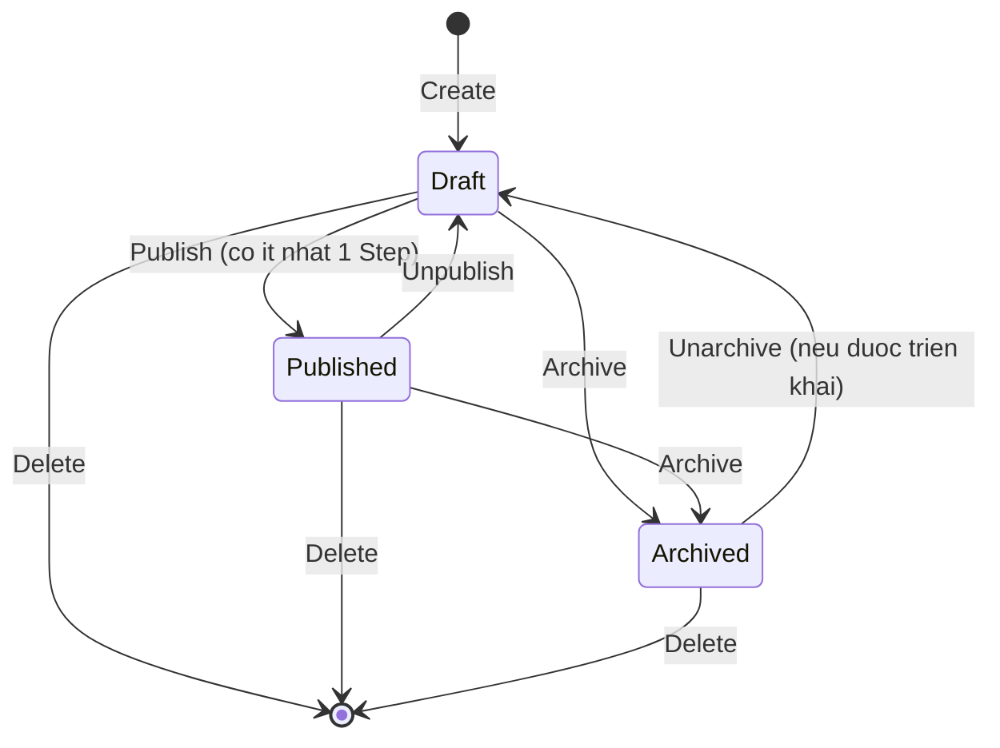
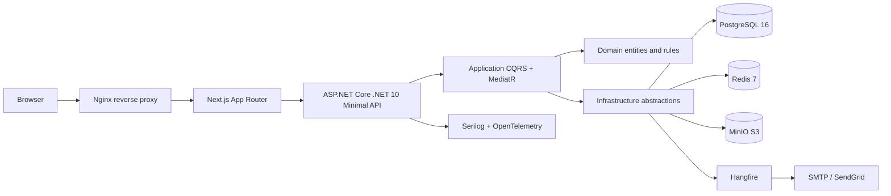

# Culinary Blog - Business and Architecture Specification

**Tai lieu nguon:** `docx/SRS_Culinary_Blog_v1.0.0.pdf`  
**Phien ban tong hop:** 1.0.0  
**Ngay phan tich:** 2026-09-16  
**Pham vi:** Lam ro logic nghiep vu, kien truc muc tieu va hien trang ma nguon.

> Tai lieu nay la ban tong hop va dien giai SRS, khong thay the SRS da duoc phe duyet. Cac quy tac duoi day duoc viet theo huong co the dung lam co so cho Domain model, API contract, UI flow va test acceptance.

## 1. Tom tat he thong

Culinary Blog la ung dung web full-stack cho phep:

- Khach xem, tim kiem, loc va kham pha cong thuc da cong khai.
- Tac gia tao, bien tap, quan ly anh/nguyen lieu/cac buoc va cong khai cong thuc cua minh.
- Quan tri vien quan ly danh muc, co the quan ly cong thuc cua moi tac gia va theo doi he thong.
- He thong luu du lieu quan he trong PostgreSQL, tep anh trong MinIO, cache dung Redis va xu ly tac vu cham bang Hangfire.

### Ngoai pham vi phien ban 1.0

Khong bao gom binh luan, danh gia sao, yeu thich/bookmark, thong bao realtime, ung dung native, thanh toan, nhan tin truc tiep va GraphQL.

## 2. Actor va phan quyen

| Actor | Dieu kien | Quyen chinh |
|---|---|---|
| Guest | Khong can tai khoan | Chi xem Published recipes, categories va tim kiem |
| Author | Tai khoan dang nhap, role Author | Toan bo quyen Guest; tao/sua/xoa/quang ba/luu tru recipe do minh so huu; quan ly child data |
| Admin | Tai khoan co role Admin | Toan bo quyen Author; CRUD category; sua/xoa recipe cua bat ky author; xem dashboard Hangfire va log |

### Ba lop kiem tra quyen

1. **RBAC:** endpoint yeu cau role Author hoac Admin.
2. **Resource-based authorization:** Author chi thao tac recipe khi `Recipe.AuthorId == CurrentUserId`; Admin duoc bypass ownership.
3. **Policy-based authorization:** policy `VerifiedAuthor` co the yeu cau email da xac minh cho cac thao tac tac gia.

Kiem tra ownership phai nam trong Application/domain workflow, khong chi dua vao middleware endpoint, de tranh bo sot khi goi use case tu kenh khac.

## 3. Mo hinh nghiep vu cot loi

### 3.1 Recipe la Aggregate Root

`Recipe` quan ly cac thanh phan con:

- `RecipeStep[]`: cac buoc thuc hien, hien thi theo `StepNumber`.
- `RecipeIngredient[]`: nguyen lieu, hien thi theo `OrderIndex`.
- `RecipeImage[]`: anh goc, medium, thumbnail va metadata.
- `RecipeNutrition`: owned value/entity, duoc nhung vao bang Recipes.
- `Category` va `ApplicationUser` la tham chieu den aggregate/entity khac.

Moi mutation recipe va child data nen di qua use case/Unit of Work de dam bao transaction, authorization, validation va cache invalidation.

### 3.2 Vong doi Recipe



Quy tac:

- Tao moi luon bat dau o `Draft`.
- `Publish` chi thanh cong khi recipe co it nhat mot step.
- Publish/unpublish la idempotent: goi lai khi da o trang thai dich thi tra thanh cong, khong tao loi nghiep vu.
- `Published` moi duoc hien thi cho Guest, duoc tim kiem va dua vao sitemap.
- `Draft`/`Archived` chi xem duoc boi owner hoac Admin.
- `Archive` an noi dung khoi public listing nhung van giu ban ghi.
- Slug duoc sinh tu title, unique, khong doi sau khi publish.

### 3.3 Luong tao va cong khai recipe

1. Author/Admin gui thong tin co ban, category, thoi gian, servings, difficulty va tuy chon steps/ingredients/nutrition.
2. Application validation kiem tra du lieu va category ton tai.
3. Domain tao recipe voi status Draft va slug unique.
4. Luu aggregate trong mot transaction.
5. Author bo sung steps, ingredients va images neu chua gui cung request.
6. Khi publish, Domain kiem tra so luong steps > 0.
7. Neu hop le, status chuyen Published, gan `PublishedAt`, invalid cache va cap nhat search visibility.

### 3.4 Category

- Admin tao category; slug sinh tu name va them suffix so neu trung.
- Doi name khong doi slug da ton tai de tranh broken link.
- Khong duoc xoa category khi con bat ky recipe nao, ke ca Draft/Archived; tra `409 Conflict` va so luong recipe.
- Danh sach category va chi tiet category la public.

### 3.5 Anh

- Chi owner/Admin duoc upload, set primary va delete.
- File toi da 5 MB; MIME cho phep: JPEG, PNG, WebP, AVIF.
- Phai kiem tra magic bytes, khong tin duy nhat vao extension/Content-Type.
- Ten object phai sinh bang GUID theo mau `recipes/{recipeId}/{guid}.{ext}` de tranh path traversal.
- Anh dau tien tu dong la primary; tai moi thoi diem chi co mot primary.
- Upload luu original truoc; Hangfire tao medium 800x600 va thumbnail 300x300.
- Xoa primary thi tu dong chon anh con lai dau tien lam primary.

### 3.6 Nguyen lieu va buoc

**Ingredient:** `Name` 1-100 ky tu, `Quantity > 0`, `Unit` khong rong, `Notes` tuy chon; sap xep theo `OrderIndex`.

**Step:** `Description` khong rong, toi da 2.000 ky tu; them moi tu dong lay so tiep theo; xoa step phai danh lai so lien tuc 1, 2, 3,...

### 3.7 Xoa va tinh toan ven du lieu

- Xoa category la soft delete theo SRS va bi chan neu con recipe.
- Xoa recipe theo API duoc mo ta la hard delete database, cascade child entities; file MinIO xoa bat dong bo va retry qua Hangfire.
- `BaseEntity` co `IsDeleted` va global query filter. Can chot ro pham vi soft delete cua Recipe vi SRS vua mo ta soft delete chung, vua quy dinh hard delete recipe.
- `RowVersion` dung cho optimistic concurrency. Update recipe phai gui version hien tai qua `If-Match` hoac body; mismatch tra `409 Conflict`.

## 4. Tim kiem, loc, phan trang va cache

### Tim kiem

- PostgreSQL `tsvector/tsquery`, GIN index, `unaccent` de ho tro tim khong dau.
- Query toi thieu 2 ky tu; sanitize tu khoa va parameterize qua EF Core.
- Chi tim trong Published recipes; sap xep theo `ts_rank` giam dan.
- Khong co ket qua van tra `200` voi danh sach rong.

### Loc va phan trang

- Filter ket hop bang AND: category, difficulty, cook time, servings.
- Sort ho tro `createdAt`, `title`, `cookTime`; prefix `-` la descending.
- `page >= 1`, `pageSize` mac dinh 12 va toi da 50.
- Response phan trang can co `items`, `totalCount`, `page`, `pageSize`, `totalPages`, `hasNextPage`, `hasPreviousPage`.

### Cache

- Category list: TTL muc tieu 30 phut.
- Recipe detail: cache theo slug va tag `recipes`, TTL theo SRS can thong nhat giua 5 va 60 phut.
- Recipe list/search: cache theo query string neu can; search co the TTL ngan 1-5 phut.
- Moi command thanh cong phai invalid cache lien quan.
- Redis la cache dung chung; khi Redis down, he thong fallback ve database va khong lam request that bai chi vi cache.

## 5. Xac thuc va token

- Dang ky bang email/password; password do ASP.NET Core Identity hash, khong luu plaintext.
- Dang nhap local hoac Google OAuth 2.0.
- Access JWT stateless: TTL 15 phut, claim toi thieu userId/email/roles/jti.
- Refresh token random cryptographic 128-bit, chi luu SHA-256 hash trong DB, TTL 7 ngay.
- Refresh rotation: token cu bi revoke ngay sau khi dung; phat hien reuse thi revoke ca token family.
- Logout revoke refresh token.
- Rate limit muc tieu: auth 10 request/phut/IP, API 100 request/phut/IP, upload 5 request/phut/IP.

## 6. API contract tong hop

Base URL: `/api/v1`. Authentication dung `Authorization: Bearer <access_token>`; refresh token gui trong body. Success response co the dung wrapper `data` va `meta`; loi dung RFC 7807 `application/problem+json` voi `type`, `title`, `status`, `detail`, `errors`.

| Module | Endpoint chinh | Quyen |
|---|---|---|
| Auth | `POST /auth/register`, `/login`, `/google`, `/refresh`, `/logout`; `GET/PATCH /auth/me` | Theo tung thao tac |
| Categories | `GET /categories`, `GET /categories/{slug}` | Public |
| Categories | `POST /categories`, `PUT /categories/{id}`, `DELETE /categories/{id}` | Admin |
| Recipes | `GET /recipes`, `GET /recipes/{slug}`, `GET /recipes/search` | Public co bo loc visibility |
| Recipes | `POST /recipes` | Author/Admin |
| Recipes | `PUT /recipes/{id}`, publish, unpublish, archive, delete | Owner/Admin |
| Images | POST/PATCH primary/DELETE `/recipes/{id}/images...` | Owner/Admin |
| Steps | POST/PUT/DELETE `/recipes/{id}/steps...` | Owner/Admin |
| Ingredients | POST/PUT/DELETE `/recipes/{id}/ingredients...` | Owner/Admin |
| Operations | `GET /health`, `/health/live`, `/health/ready` | Public/probe |

HTTP status quan trong: `201` tao, `200` doc/cap nhat, `204` xoa/logout, `400` request sai, `401` chua xac thuc, `403` khong du quyen, `404` khong tim thay, `409` conflict ownership/concurrency/unique/constraint, `422` validation/domain rule, `429` rate limit, `503` dependency tam thoi khong san sang.

## 7. Kien truc logic



### 7.1 Backend Clean Architecture

**Domain (`CulinaryBlog.Domain`):** entities, value objects, enums, domain exceptions/events va abstraction repository; khong phu thuoc Infrastructure/API.

**Application (`CulinaryBlog.Application`):** Commands/Queries, handlers, DTOs, validators FluentValidation, interfaces va MediatR behaviors. Chi phu thuoc Domain.

**Infrastructure (`CulinaryBlog.Infrastructure`):** EF Core DbContext/configuration/migrations, repository/UnitOfWork, Identity, JWT, Redis, MinIO, email, Hangfire va observability. Implement interfaces cua Application.

**Presentation (`CulinaryBlog.API`):** Minimal API endpoint groups, middleware, DI composition root, auth policy, OpenAPI/Scalar va HTTP mapping.

Dependency direction:

```text
API -> Infrastructure -> Application -> Domain
API -> Application -> Domain
Domain -X-> Application/Infrastructure/API
Application -X-> Infrastructure/API
```

### 7.2 CQRS pipeline

Thu tu de xuat:

1. `LoggingBehavior`: request, user, correlation id, elapsed time; canh bao > 500 ms.
2. `ValidationBehavior`: FluentValidation truoc handler.
3. `CachingBehavior`: doc Redis cho Query co cache contract.
4. Handler: thuc thi use case, domain rule, repository va DTO mapping.
5. `CacheInvalidationBehavior`: xoa tag sau Command thanh cong.

Command khong doc ket hop voi Query trong cung use case; Query khong thay doi state.

### 7.3 Frontend Next.js

- App Router, TypeScript, Tailwind CSS.
- Public pages dung SSR/ISR de SEO; dashboard va auth dung CSR.
- TanStack Query quan ly server state, React Hook Form + Zod cho form, Auth.js/adapter cho auth theo thiet ke.
- Route chinh: `/`, `/recipes`, `/recipes/[slug]`, `/categories`, `/categories/[slug]`, `/search`, `/auth/login`, `/auth/register`, `/dashboard`, `/dashboard/recipes`, `/dashboard/recipes/new`, `/dashboard/recipes/[id]/edit`, `/dashboard/categories`, `/profile`.
- Published page co JSON-LD Schema.org Recipe, Open Graph, canonical URL; Draft/Archived phai `noindex`.

### 7.4 Data model

| Entity | Quan he va ghi chu |
|---|---|
| BaseEntity | UUID, CreatedAt, UpdatedAt, IsDeleted, RowVersion |
| Recipe | N:1 Category, N:1 Author; aggregate root; status/difficulty/slug/search vector |
| RecipeStep | 1:N voi Recipe; cascade delete; step number lien tuc |
| RecipeIngredient | 1:N voi Recipe; cascade delete; quantity/unit/order |
| RecipeImage | 1:N voi Recipe; original/medium/thumbnail; mot primary |
| RecipeNutrition | Owned 1:1, cot `Nutrition_*` trong Recipes |
| Category | name/slug unique; khong xoa neu con recipe |
| ApplicationUser | ASP.NET Identity + display name/avatar/bio/isActive |
| RefreshToken | hash unique, expiry, revoked/replaced token family |

PostgreSQL dung EF Core Code First; `unaccent` va `pg_trgm` bat buoc cho search. Index can co B-tree cho slug/foreign key/filter/sort va GIN cho SearchVector.

### 7.5 Deployment va van hanh

Docker Compose muc tieu gom Nginx, API, frontend, PostgreSQL, Redis, MinIO; Seq va MailHog chi danh cho development. Production can TLS termination, persistent volumes, backup PostgreSQL hang ngay, health probes va secrets qua environment/User Secrets/Kubernetes Secrets.

Observability bat buoc:

- `/health`: database, Redis, MinIO.
- `/health/live`: process con song.
- `/health/ready`: dependency san sang.
- Structured log co CorrelationId, path, method, status, elapsed, UserId.
- OpenTelemetry cho HTTP, EF Core, custom metrics recipe created/published.

## 8. Yeu cau phi chuc nang quan trong

- API: p50 <= 150 ms cho GET cache hit, p95 <= 500 ms, p99 <= 1 s.
- Ho tro toi thieu 100 concurrent users tren cau hinh toi thieu.
- Redis hit rate muc tieu >= 80% khi steady state.
- Khong co N+1 query; phai dung projection/eager loading hop ly.
- Security theo OWASP Top 10; HTTPS TLS 1.2+, CORS theo allowlist, CSP, rate limiting.
- UI responsive 320 px tro len, WCAG 2.1 AA, keyboard accessible.
- Uptime muc tieu >= 99.5%; retry job va global exception handling.
- Unit coverage toi thieu 80% cho Application; moi endpoint co happy path va error case; E2E cho register, login, create, publish, search.
- SEO: JSON-LD, meta/Open Graph, sitemap va robots.

## 9. Hien trang ma nguon tai thoi diem phan tich

Ket qua doi chieu voi workspace hien tai:

- `src/CulinaryBlog.API/Program.cs` dang la scaffold Minimal API voi endpoint mau `/weatherforecast`; chua co endpoint Culinary Blog, middleware, auth hay DI cua cac layer.
- `CulinaryBlog.Domain.csproj` moi co folder placeholders; chua co entity/domain rule trong cac thu muc du kien.
- `CulinaryBlog.Infrastructure/Persistence/ApplicationDbContext.cs` dang rong; chua co DbContext, Identity, entity mapping, global filters hay migrations.
- `CulinaryBlog.Infrastructure/Persistence/UnitOfWork.cs` dang rong.
- `CulinaryBlog.Application.csproj` da co MediatR, FluentValidation va Mapster, nhung cac use case/handler/validator chua duoc hien thuc trong cac file nguon hien co.
- Next.js frontend van la trang mac dinh create-next-app; `app/page.tsx` hien thi logo Next/Vercel va `app/layout.tsx` con metadata Create Next App.

Vi vay, cac muc tu 1 den 8 la **kien truc va hanh vi muc tieu**; muc 9 la **baseline hien tai**, khong nen hieu la tinh nang da hoan thanh.

## 10. Cac diem can chot truoc khi implement

1. **Soft delete vs hard delete Recipe:** BaseEntity/SRS mo ta soft delete, nhung FR-RCP-007 yeu cau hard delete recipe. Chon mot quy tac chinh; khuyen nghi dung soft delete cho kha nang khoi phuc va tao job cleanup rieng neu can xoa vat ly.
2. **Cache TTL:** Recipe detail duoc neu 5 phut trong NFR va 60 phut trong FR; chot mot gia tri va viet thanh config.
3. **OAuth flow:** SRS vua neu Google Sign-In `idToken`, vua neu Authorization Code + PKCE callback. Chon mot flow theo frontend/backend boundary va ghi ro token nao duoc backend verify.
4. **Slug update:** SRS noi slug khong doi sau publish nhung cung de cap redirect khi slug draft thay doi; quy dinh ro co cho phep doi slug truoc publish hay khong.
5. **API wrapper:** Chot response co luon `{data, meta}` hay chi dung wrapper cho paginated result de frontend va test khong phai suy doan.
6. **Role registration:** User dang ky mac dinh role Author; Admin chi gan qua seed/administrative workflow, khong cho client tu chon role.
7. **Frontend auth storage:** Refresh token khong nen luu trong localStorage; chot cookie httpOnly hoac mot co che client an toan phu hop voi API contract.
8. **Concurrency:** Chot encoding cua `RowVersion` trong ETag/If-Match va cach map `DbUpdateConcurrencyException` thanh Problem Details 409.

## 11. Thu tu hien thuc de xuat

1. Dung Domain model, enum/status, BaseEntity, exception va rule publish/ownership.
2. Tao EF Core DbContext, Identity, configurations, migrations, indexes, seed va UnitOfWork.
3. Tao Application CQRS cho auth/category/recipe; validators, authorization va mapping.
4. Tao Infrastructure cho JWT/refresh rotation, Redis, MinIO, Hangfire va email.
5. Tao API endpoints, middleware, RFC 7807, rate limit, health check va Scalar.
6. Tao frontend public pages truoc, sau do auth/dashboard; ket noi TanStack Query voi API.
7. Viet unit/integration/E2E tests theo cac luong critical va architecture tests de giu dependency rule.
8. Them Docker Compose, observability, SEO, backup va CI checks.

## 12. Acceptance checklist cot loi

- [ ] Guest khong thay Draft/Archived cua nguoi khac.
- [ ] Author khong sua/xoa/publish recipe cua author khac.
- [ ] Admin quan ly duoc category va recipe cua moi owner.
- [ ] Khong publish recipe khong co step.
- [ ] Category con recipe bi tu choi xoa voi 409.
- [ ] Chi mot anh primary; upload validate size, MIME va magic bytes.
- [ ] Xoa step danh lai StepNumber lien tuc.
- [ ] Refresh token duoc hash, rotate va phat hien reuse.
- [ ] Search khong dau tieng Viet tra ket qua Published theo relevance.
- [ ] Write operation invalid cache va concurrency conflict tra 409.
- [ ] Loi API theo RFC 7807, co correlation id va khong lo stack trace.
- [ ] `/health/live` va `/health/ready` phan biet dung muc dich.
- [ ] Build/test architecture khong vi pham dependency direction.
