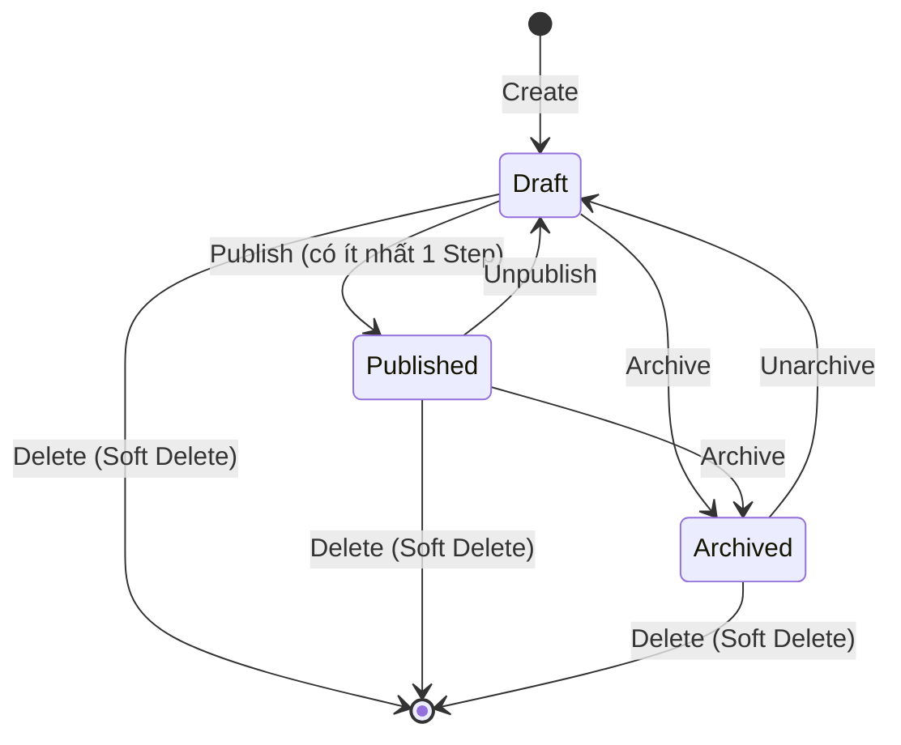
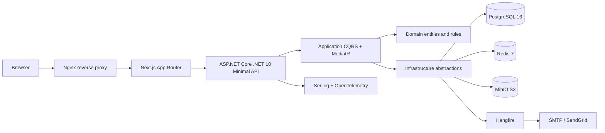
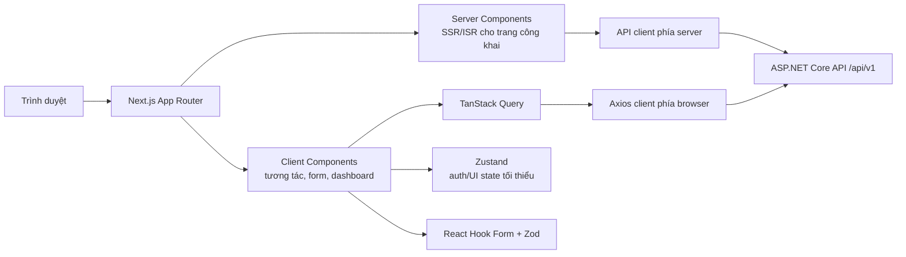

# Culinary Blog - Business and Architecture Specification

**Tài liệu nguồn:** `docx/SRS_Culinary_Blog_v1.0.0.pdf`  
**Phiên bản tổng hợp:** 1.2.0 (Bổ sung kiểm tra kiến trúc và phân tích frontend)  
**Ngày phân tích:** 2026-09-21  
**Phạm vi:** Làm rõ logic nghiệp vụ, kiến trúc mục tiêu, công nghệ frontend, chuẩn hóa các mâu thuẫn đặc tả và hiện trạng mã nguồn.

> Tài liệu này là bản tổng hợp và diễn giải chuẩn hóa từ SRS, đóng vai trò căn cứ kỹ thuật chính xác cho Domain model, API contract, UI flow, Database migrations và test acceptance.

## 1. Tóm tắt hệ thống

Culinary Blog là ứng dụng web full-stack cho phép:

- Khách xem, tìm kiếm, lọc và khám phá công thức đã công khai.
- Tác giả tạo, biên tập, quản lý ảnh/nguyên liệu/các bước và công khai công thức của mình.
- Quản trị viên quản lý danh mục, có thể quản lý công thức của mọi tác giả và theo dõi hệ thống.
- Hệ thống lưu dữ liệu quan hệ trong PostgreSQL, tệp ảnh trong MinIO, cache dùng Redis và xử lý tác vụ chậm bằng Hangfire.

### Ngoài phạm vi phiên bản 1.0

Không bao gồm bình luận, đánh giá sao, yêu thích/bookmark, thông báo realtime, ứng dụng native, thanh toán, nhắn tin trực tiếp và GraphQL.

## 2. Actor và phân quyền

| Actor | Điều kiện | Quyền chính |
|---|---|---|
| Khách (Guest / Anonymous) | Không cần tài khoản | Chỉ xem Published recipes, categories và tìm kiếm. KHÔNG được tạo/sửa/xóa. |
| Tác giả (Author) | Tài khoản đăng nhập, role Author | Toàn bộ quyền Guest; tạo/sửa/xóa/xuất bản/lưu trữ recipe do mình sở hữu; quản lý child data (steps, ingredients, images). |
| Quản trị viên (Admin) | Tài khoản có role Admin | Toàn bộ quyền Author; CRUD category; sửa/xóa/quản lý recipe của bất kỳ author; truy cập Hangfire Dashboard và xem structured logs. |

### Ba lớp kiểm tra quyền

1. **RBAC:** Endpoint yêu cầu role Author hoặc Admin. User đăng ký mặc định là Author; Admin chỉ gán qua seed hoặc quy trình nội bộ.
2. **Resource-based authorization:** Author chỉ thao tác recipe khi `Recipe.AuthorId == CurrentUserId`; Admin được bypass ownership check. Nếu vi phạm ownership, hệ thống trả về HTTP `403 Forbidden` (hoặc `404 Not Found`).
3. **Policy-based authorization:** Policy `VerifiedAuthor` có thể yêu cầu email đã xác minh cho các thao tác tác giả.

Kiểm tra ownership phải nằm trong Application/domain workflow, không chỉ dựa vào middleware endpoint, để tránh bỏ sót khi gọi use case từ kênh khác.

## 3. Mô hình nghiệp vụ cốt lõi

### 3.1 Recipe là Aggregate Root

`Recipe` quản lý các thành phần con:

- `RecipeStep[]`: Các bước thực hiện, sắp xếp và hiển thị theo `StepNumber`.
- `RecipeIngredient[]`: Danh sách nguyên liệu, sắp xếp theo `OrderIndex`.
- `RecipeImage[]`: Ảnh gốc, medium, thumbnail và metadata, sắp xếp theo `OrderIndex`.
- `RecipeNutrition`: Owned value/entity, được nhúng trực tiếp vào bảng Recipes (gồm 6 chỉ số dinh dưỡng).
- `Category` và `ApplicationUser` là tham chiếu đến aggregate/entity khác.

Mọi mutation recipe và child data nên đi qua use case/Unit of Work để đảm bảo transaction, authorization, validation và cache invalidation.

### 3.2 Vòng đời Recipe



Quy tắc vòng đời:

- Tạo mới luôn bắt đầu ở trạng thái `Draft`.
- `Publish` chỉ thành công khi recipe có ít nhất một bước thực hiện (`Steps.Count > 0`).
- Publish/unpublish là idempotent: gọi lại khi đã ở trạng thái đích thì trả thành công (`200 OK`), không tạo lỗi nghiệp vụ.
- `Published` mới được hiển thị cho Guest, được tìm kiếm và đưa vào sitemap.
- `Draft`/`Archived` chỉ xem được bởi owner hoặc Admin.
- `Archive` ẩn nội dung khỏi public listing nhưng vẫn giữ bản ghi trong CSDL. Hỗ trợ thao tác `Unarchive` để đưa công thức từ Archived quay trở lại `Draft`.
- **Ràng buộc bất biến của Published Recipe:** Khi công thức đang ở trạng thái `Published`, hệ thống ngăn chặn việc xóa bước nếu công thức chỉ còn duy nhất 1 bước (trả về lỗi `422 Unprocessable Entity`). Tác giả phải chuyển trạng thái về `Draft` (Unpublish) trước khi muốn xóa bước đó.
- Slug được sinh tự động từ title, unique, không đổi sau khi publish để tránh broken links và bảo toàn giá trị SEO. Nếu đổi title sau khi đã publish, slug vẫn giữ nguyên.

### 3.3 Luồng tạo và công khai recipe

1. Author/Admin gửi thông tin cơ bản, category, thời gian, servings, difficulty và tùy chọn steps/ingredients/nutrition.
2. Application validation kiểm tra dữ liệu và category tồn tại.
3. Domain tạo recipe với status Draft và sinh slug unique (nếu trùng slug thì tự động thêm hậu tố số tăng dần: `-2`, `-3`...).
4. Lưu aggregate trong một transaction duy nhất.
5. Author bổ sung steps, ingredients và images nếu chưa gửi cùng request ban đầu.
6. Khi publish, Domain kiểm tra số lượng steps > 0.
7. Nếu hợp lệ, status chuyển Published, gán `PublishedAt`, invalidate cache và cập nhật search visibility.

### 3.4 Category

- Admin tạo category; slug sinh từ name và tự động thêm suffix số nếu trùng (`-2`, `-3`...).
- Đổi name không đổi slug đã tồn tại để tránh broken links.
- Không được xóa category khi còn bất kỳ recipe nào, kể cả Draft/Archived; trả về `409 Conflict` và số lượng recipe hiện có.
- Xóa category áp dụng **Soft Delete** (`IsDeleted = true`). CSDL cấu hình Filtered Unique Index trên `Slug` (`WHERE "IsDeleted" = false`) để tránh xung đột khi tạo mới.
- Danh sách category và chi tiết category là public.

### 3.5 Ảnh

- Chỉ owner/Admin được upload, set primary và delete.
- File tối đa 5 MB; MIME cho phép: JPEG, PNG, WebP, AVIF.
- Phải kiểm tra magic bytes, không tin duy nhất vào extension/Content-Type.
- Tên object phải sinh bằng GUID theo mẫu `recipes/{recipeId}/{guid}.{ext}` để tránh path traversal.
- Ảnh đầu tiên tự động là primary; tại mỗi thời điểm chỉ có duy nhất một ảnh primary.
- Upload lưu original trước; Hangfire tạo medium 800x600 và thumbnail 300x300.
- Xóa primary thì tự động chọn ảnh còn lại có `OrderIndex` (hoặc thời gian tạo) nhỏ nhất làm primary.

### 3.6 Nguyên liệu và bước thực hiện (Chuẩn hóa giải pháp)

**Nguyên liệu (RecipeIngredient):**
- `Name`: Bắt buộc, độ dài từ 1–200 ký tự.
- `Quantity` và `Unit`: **Nullable (Tùy chọn)** ở cả Database, Entity và DTO để hỗ trợ các nguyên liệu nêm nếm theo khẩu vị ("vừa đủ", "tùy ý"). Nếu người dùng có nhập `Quantity` thì FluentValidation kiểm tra `Quantity > 0`.
- `Notes`: Tùy chọn (tối đa 500 ký tự).
- `OrderIndex`: Số nguyên biểu thị thứ tự hiển thị, mặc định 0 (thống nhất dùng `OrderIndex`, loại bỏ hoàn toàn `SortOrder`).

**Bước thực hiện (RecipeStep):**
- `Title`: Bắt buộc, độ dài 1–200 ký tự (nếu client để trống, backend tự động gán mặc định `$"Bước {stepNumber}"`).
- `Description`: Bắt buộc, không rỗng, tối đa 2.000 ký tự.
- `TimerMinutes`: Thời gian hẹn giờ cho bước tính bằng phút, số nguyên >= 0, nullable (thống nhất dùng `TimerMinutes`, loại bỏ `DurationMinutes`).
- `ImageUrl`: URL ảnh minh họa riêng cho bước, nullable.
- `StepNumber`: **Server là nguồn chân lý duy nhất (Single Source of Truth)**. Khi thêm bước mới qua `POST /recipes/{id}/steps`, client KHÔNG truyền `stepNumber`; backend tự động tính toán `Max(StepNumber) + 1` (hoặc 1 nếu chưa có bước nào).
- **Cập nhật nội dung bước:** Endpoint `PUT /recipes/{id}/steps/{stepId}` chỉ dùng để sửa thông tin (`title`, `description`, `timerMinutes`, `imageUrl`), không chứa `stepNumber` để tránh vi phạm khóa duy nhất.
- **Đổi thứ tự bước (Reorder):** Tách riêng endpoint chuyên dụng `PUT /recipes/{id}/steps/reorder` nhận mảng `{ "stepIds": ["id1", "id2", ...] }` và cập nhật lại `StepNumber = 1, 2, 3...` trong một transaction an toàn, tránh lỗi xung đột `UNIQUE(RecipeId, StepNumber)`.
- **Xóa bước:** Xóa bước qua `DELETE /recipes/{id}/steps/{stepId}` sẽ tự động renumber các bước còn lại theo thứ tự liên tục (1, 2, 3...). Nếu bài viết đang `Published` và chỉ còn đúng 1 bước, hệ thống chặn xóa và trả về lỗi `422 Unprocessable Entity`.

### 3.7 Xóa và tính toàn vẹn dữ liệu (Mô hình 2 giai đoạn)

Hệ thống áp dụng mô hình **Xóa 2 giai đoạn (Two-Stage Deletion Lifecycle)** để giải quyết dứt điểm xung đột giữa Soft Delete và Hard Delete:

1. **Giai đoạn 1 (Thao tác của người dùng / Admin):**
   - API `DELETE /api/v1/recipes/{id}` thực hiện **Soft Delete**: gán `IsDeleted = true`, `Status = RecipeStatus.Archived`, cập nhật `UpdatedAt = DateTime.UtcNow`.
   - **Không xóa file ảnh trên MinIO ngay** nhằm bảo vệ dữ liệu và hỗ trợ phục hồi khi xóa nhầm (tuân thủ cam kết NFR-REL-003).
   - Global Query Filter (`.Where(x => !x.IsDeleted)`) tự động loại trừ bài viết khỏi các truy vấn thông thường.
   - Invalidate cache Redis liên quan và trả về HTTP `204 No Content`.
2. **Giai đoạn 2 (Dọn dẹp vật lý tự động qua Hangfire):**
   - Định kỳ hàng tuần, Hangfire Recurring Job (`PurgeDeletedRecipesJob`) quét các công thức có `IsDeleted == true` quá 30 ngày để thực hiện **Hard Delete**:
     - Gửi yêu cầu xóa bất đồng bộ toàn bộ file ảnh trên MinIO qua `IFileStorageService.DeleteAsync()` (Hangfire tự động retry 3 lần nếu lỗi).
     - Xóa vật lý bản ghi Recipe trong CSDL, kích hoạt cascade delete loại bỏ toàn bộ Steps, Ingredients và Images.
3. **Xử lý Unique Index trên Slug:**
   - CSDL PostgreSQL áp dụng **Filtered Unique Index (Partial Index)**:
     ```sql
     CREATE UNIQUE INDEX "IX_Recipes_Slug" ON "Recipes" ("Slug") WHERE "IsDeleted" = false;
     ```
   - Điều này đảm bảo khi bài viết cũ bị xóa mềm, người dùng vẫn có thể tạo bài viết mới trùng Title/Slug mà không bị lỗi duplicate key.
4. **Optimistic Concurrency:**
   - `RowVersion` (bytea/timestamp) dùng cho concurrency control. Cập nhật Recipe phải gửi version hiện tại qua header `If-Match` hoặc body; nếu mismatch ném ngoại lệ trả về `409 Conflict`.

## 4. Tìm kiếm, lọc, phân trang và cache

### Tìm kiếm

- PostgreSQL `tsvector/tsquery`, GIN index, `unaccent` để hỗ trợ tìm không dấu tiếng Việt.
- Query tối thiểu 2 ký tự; sanitize từ khóa và parameterize qua EF Core để chống SQL Injection.
- Chỉ tìm kiếm trong các công thức có `Status == Published`; sắp xếp theo `ts_rank` giảm dần.
- Không có kết quả vẫn trả về `200 OK` với danh sách rỗng `[]`.

### Lọc và phân trang

- Filter kết hợp bằng logic AND: category, difficulty, cook time, servings.
- **Quy ước Sắp xếp chuẩn hóa:**
  - Chuẩn API công khai sử dụng cặp query parameters: **`sortBy`** và **`sortOrder`** (theo đúng Chương 8):
    - `sortBy`: `createdAt` (mặc định), `title`, `cookTime`.
    - `sortOrder`: `desc` (mặc định), `asc`.
  - Tầng Application hỗ trợ tương thích ngược (backward compatibility): Tự động phân tích cú pháp nếu client truyền dạng tiền tố âm `sort=-createdAt` hoặc `sort=title`.
- Phân trang Offset-based: `page >= 1`, `pageSize` mặc định 12 và tối đa 50.
- Response phân trang chuẩn hóa đồng nhất wrapper:
  ```json
  {
    "data": [ ... ],
    "meta": {
      "page": 1,
      "pageSize": 12,
      "totalCount": 100,
      "totalPages": 9,
      "hasNextPage": true,
      "hasPreviousPage": false
    }
  }
  ```

### Cache

- Category list: Cache Redis/IMemoryCache với TTL mục tiêu 30–60 phút.
- Recipe detail: Cache theo slug và tag `recipes`, TTL chuẩn hóa **60 phút** (cấu hình qua `appsettings.json`), sử dụng cache-aside / Output Cache kết hợp tag-based invalidation.
- Recipe list/search: Cache theo query string, TTL ngắn 1–5 phút.
- Mọi mutation command thành công phải invalidate cache liên quan (xóa tag `recipes` và tag `recipe:{slug}`).
- Redis là cache dùng chung; khi Redis down, hệ thống tự động fallback về database (graceful degradation) mà không làm sập request.

## 5. Xác thực và token

- Đăng ký bằng email/password; mật khẩu do ASP.NET Core Identity hash với PBKDF2 (HMAC-SHA512, >= 100.000 iterations).
- Đăng nhập local hoặc Google OAuth 2.0. Chuẩn hóa luồng: Frontend dùng Google Identity Services / One Tap lấy `idToken`, gửi lên endpoint `POST /api/v1/auth/google`, Backend dùng thư viện `Google.Apis.Auth` để xác thực token.
- User đăng ký tài khoản mới mặc định nhận role **Author**. Role **Admin** chỉ gán qua database seeding hoặc quy trình quản trị nội bộ.
- Access JWT stateless: TTL 15 phút, claim tối thiểu: `userId`, `email`, `roles`, `jti`. Lưu trữ tại client trong memory / React state.
- Refresh token: 128-bit cryptographically secure random bytes, chỉ lưu SHA-256 hash trong CSDL, TTL 7 ngày.
- **Lưu trữ Refresh Token an toàn:** Lưu trong **httpOnly, Secure, SameSite=Lax (hoặc Strict) Cookie** để triệt tiêu nguy cơ đánh cắp token qua XSS.
- **Refresh Token Rotation & Reuse Detection:** Token cũ bị revoke ngay sau khi sử dụng; nếu phát hiện token đã bị revoke được gửi lại (dấu hiệu replay attack), hệ thống lập tức thu hồi toàn bộ token family của tài khoản đó.
- Đăng xuất (`POST /auth/logout`): Xóa cookie và thu hồi refresh token trong CSDL.
- Rate limiting: auth 10 request/phút/IP, API chung 100 request/phút/IP, upload 5 request/phút/IP.

## 6. API contract tổng hợp

Base URL: `/api/v1`. Authentication dùng `Authorization: Bearer <access_token>`; Refresh token truyền an toàn qua httpOnly Cookie (hoặc JSON body cho client non-browser). Success response đồng nhất dùng wrapper `{ "data": ... }` hoặc `{ "data": [...], "meta": {...} }`; phản hồi lỗi tuân thủ chuẩn RFC 7807 `application/problem+json` với `type`, `title`, `status`, `detail`, `errors`.

| Module | Endpoint chính | Quyền hạn | Mô tả |
|---|---|---|---|
| **Auth** | `POST /auth/register` | Public | Đăng ký tài khoản mới (tự động gán role Author) |
| | `POST /auth/login` | Public | Đăng nhập email/mật khẩu, cấp bộ token |
| | `POST /auth/google` | Public | Đăng nhập Google OAuth qua `idToken` |
| | `POST /auth/refresh` | Public | Làm mới Access Token bằng Refresh Token |
| | `POST /auth/logout` | Author/Admin | Đăng xuất, thu hồi Refresh Token |
| | `GET /auth/me` | Author/Admin | Xem thông tin hồ sơ tài khoản hiện tại |
| | `PATCH /auth/me` | Author/Admin | Cập nhật hồ sơ (displayName, bio, avatarUrl) |
| **Categories** | `GET /categories` | Public | Lấy danh sách danh mục (cache-aside) |
| | `GET /categories/{slug}` | Public | Chi tiết danh mục kèm danh sách recipes phân trang |
| | `POST /categories` | Admin | Tạo danh mục mới |
| | `PUT /categories/{id}` | Admin | Cập nhật tên/mô tả danh mục |
| | `DELETE /categories/{id}` | Admin | Xóa mềm danh mục (chặn nếu còn chứa recipes) |
| **Recipes** | `GET /recipes` | Public | Danh sách recipes (lọc, phân trang, `sortBy`, `sortOrder`) |
| | `GET /recipes/{slug}` | Public / Owner | Chi tiết recipe theo slug (kèm đầy đủ nested data) |
| | `GET /recipes/search` | Public | Tìm kiếm FTS không dấu (`?q=...`) |
| | `POST /recipes` | Author/Admin | Tạo recipe mới (trạng thái Draft) |
| | `PUT /recipes/{id}` | Owner/Admin | Cập nhật thông tin cơ bản của recipe |
| | `PUT /recipes/{id}/nutrition` | Owner/Admin | Cập nhật riêng 6 chỉ số dinh dưỡng |
| | `PATCH /recipes/{id}/publish` | Owner/Admin | Xuất bản công thức (yêu cầu steps > 0) |
| | `PATCH /recipes/{id}/unpublish` | Owner/Admin | Hủy xuất bản (chuyển về Draft) |
| | `PATCH /recipes/{id}/archive` | Owner/Admin | Lưu trữ công thức (ẩn khỏi public) |
| | `PATCH /recipes/{id}/unarchive` | Owner/Admin | Khôi phục công thức từ Archived về Draft |
| | `DELETE /recipes/{id}` | Owner/Admin | Xóa công thức (Soft delete ngay, dọn vật lý sau 30 ngày) |
| **Images** | `POST /recipes/{id}/images` | Owner/Admin | Upload ảnh mới (multipart/form-data) |
| | `PATCH /recipes/{id}/images/{imgId}/primary` | Owner/Admin | Đặt làm ảnh chính duy nhất |
| | `DELETE /recipes/{id}/images/{imgId}` | Owner/Admin | Xóa ảnh khỏi recipe |
| **Steps** | `POST /recipes/{id}/steps` | Owner/Admin | Thêm bước mới (Server tự động tính StepNumber) |
| | `PUT /recipes/{id}/steps/{stepId}` | Owner/Admin | Cập nhật nội dung bước (title, desc, timer) |
| | `PUT /recipes/{id}/steps/reorder` | Owner/Admin | Đổi thứ tự toàn bộ các bước an toàn |
| | `DELETE /recipes/{id}/steps/{stepId}` | Owner/Admin | Xóa bước & tự động renumber (chặn xóa nếu bài Published còn 1 bước) |
| **Ingredients** | `POST /recipes/{id}/ingredients` | Owner/Admin | Thêm nguyên liệu (Quantity/Unit là tùy chọn) |
| | `PUT /recipes/{id}/ingredients/{ingId}` | Owner/Admin | Cập nhật nguyên liệu |
| | `DELETE /recipes/{id}/ingredients/{ingId}` | Owner/Admin | Xóa nguyên liệu |
| **Operations** | `GET /health`, `/health/live`, `/health/ready` | Public/Probe | Health check probes |

HTTP status codes quan trọng:
- `200 OK`: Truy vấn, cập nhật thành công; kết quả tìm kiếm rỗng vẫn trả về 200.
- `201 Created`: Tạo mới tài nguyên thành công.
- `204 No Content`: Xóa thành công, đăng xuất thành công.
- `400 Bad Request`: Cú pháp request sai, tệp tải lên không hợp lệ.
- `401 Unauthorized`: Chưa xác thực hoặc token hết hạn/không hợp lệ.
- `403 Forbidden`: Đã xác thực nhưng không có quyền (Author thao tác bài người khác, truy cập endpoint Admin).
- `404 Not Found`: Không tìm thấy tài nguyên (hoặc tài nguyên đã bị xóa mềm `IsDeleted = true`).
- `409 Conflict`: Trùng lặp dữ liệu unique, xung đột concurrency `RowVersion`, xóa Category đang chứa recipes.
- `422 Unprocessable Entity`: Vi phạm quy tắc nghiệp vụ domain (publish bài không có step, xóa bước duy nhất của bài published).
- `429 Too Many Requests`: Vượt quá giới hạn rate limit.
- `500 Internal Server Error`: Lỗi hệ thống chưa được bắt (không lộ stack trace ở production).
- `503 Service Unavailable`: Thành phần phụ thuộc (DB/Redis) tạm thời không sẵn sàng.

## 7. Kiến trúc logic



### 7.1 Backend Clean Architecture

- **Domain (`CulinaryBlog.Domain`):** Chứa entities, value objects, enums, domain exceptions/events và abstraction repository; không phụ thuộc Infrastructure/API hay các thư viện ngoài .NET BCL.
- **Application (`CulinaryBlog.Application`):** Commands/Queries, handlers, DTOs, FluentValidation validators, interfaces và MediatR pipeline behaviors. Chỉ phụ thuộc Domain.
- **Infrastructure (`CulinaryBlog.Infrastructure`):** EF Core DbContext, configurations, migrations, repositories, UnitOfWork, Identity, JWT, Redis, MinIO, email, Hangfire background jobs. Implement interfaces của Application.
- **Presentation (`CulinaryBlog.API`):** Minimal API endpoint groups, middleware, DI composition root, auth policies, OpenAPI/Scalar và HTTP mapping.

Dependency direction:
```text
API -> Infrastructure -> Application -> Domain
API -> Application -> Domain
Domain -X-> Application/Infrastructure/API
Application -X-> Infrastructure/API
```

### 7.2 CQRS pipeline

Thứ tự thực thi đề xuất:

1. `LoggingBehavior`: Log request, user, correlation id, elapsed time; ghi cảnh báo khi thời gian thực thi > 1.000 ms (tương thích với NFR p99 <= 1s).
2. `ValidationBehavior`: FluentValidation chạy trước khi vào handler; ném ngoại lệ trả về 422 Problem Details nếu lỗi.
3. `CachingBehavior`: Đọc Redis cache cho các Query có cài đặt interface `ICacheable`.
4. Handler: Thực thi use case, quy tắc nghiệp vụ domain, repository và ánh xạ DTO.
5. `CacheInvalidationBehavior`: Xóa cache tag liên quan sau khi Command thay đổi dữ liệu thành công.

Command không đọc kết hợp với Query trong cùng use case; Query không thay đổi state.

### 7.3 Frontend Next.js

#### 7.3.1 Kiến trúc frontend mục tiêu

Frontend là một ứng dụng **Next.js App Router** độc lập trong thư mục `culinary-blog-web`, đóng vai trò Presentation/BFF nhẹ trước ASP.NET Core API. Ranh giới trách nhiệm được thống nhất như sau:



- **Server Components là mặc định:** Trang công khai như danh sách/chi tiết recipe và category lấy dữ liệu phía server để trả HTML có nội dung, hỗ trợ SEO và giảm JavaScript gửi xuống trình duyệt.
- **Client Components chỉ dùng tại biên tương tác:** Navbar cần đọc pathname, form, modal, bộ lọc tức thời, timer và dashboard. Không đặt `"use client"` ở layout/page nếu không thực sự cần.
- **Server state và client state tách biệt:** TanStack Query quản lý dữ liệu từ API ở các màn hình tương tác; Zustand chỉ giữ trạng thái phiên/UI không phù hợp với URL hoặc server cache. Không sao chép cùng dữ liệu API vào cả hai nơi.
- **Form:** React Hook Form quản lý trạng thái/hiệu năng form; Zod định nghĩa schema xác thực phía client và suy luận type. Backend vẫn là nguồn xác thực cuối cùng.
- **Giao tiếp API:** Axios dùng cho request từ browser và có thể dùng ở server, nhưng phải tách cấu hình base URL server-side và public URL browser-side khi chạy Docker/production.

#### 7.3.2 Công nghệ frontend và trạng thái sử dụng thực tế

Phiên bản dưới đây lấy trực tiếp từ `culinary-blog-web/package.json` tại ngày phân tích:

| Công nghệ | Phiên bản khai báo | Vai trò kiến trúc | Trạng thái trong mã nguồn |
|---|---:|---|---|
| Next.js | `16.3.5` | Framework React full-stack, App Router, routing, metadata, Server/Client Components | **Đang dùng**: root layout, route group `(public)`, route động `[slug]`, `redirect`, `notFound`, metadata tĩnh/động. |
| React / React DOM | `19.2.8` | UI component và hydration | **Đang dùng**; state cục bộ xuất hiện trong `Footer`. |
| TypeScript | `^5` | Kiểm tra kiểu tĩnh | **Đang dùng**, `strict: true`, alias `@/*`; vẫn bật `allowJs: true` nên chưa phải chế độ TypeScript-only. |
| Tailwind CSS | `^4` | Utility-first CSS và design tokens | **Đang dùng** qua `@import "tailwindcss"` và `@tailwindcss/postcss`; màu thương hiệu khai báo bằng CSS variables nhưng nhiều component còn hard-code mã màu. |
| Axios | `^1.20.0` | HTTP client tới ASP.NET Core API | **Đang dùng** cho category; có request interceptor gắn Bearer token nhưng chưa có refresh/retry/error normalization. |
| TanStack Query / Devtools | `^5.102.8` | Cache, đồng bộ và mutation server state ở client | **Đã cài, chưa tích hợp**: chưa có `QueryClientProvider`, query key factory, hook query/mutation hoặc Devtools. |
| React Hook Form | `^7.88.0` | Quản lý form | **Đã cài, chưa dùng**. |
| Zod / Hook Form Resolvers | `^3.25.76` / `^5.9.1` | Schema validation và nối Zod với form | **Đã cài, chưa dùng**. |
| Zustand | `^5.0.15` | Trạng thái auth/UI toàn cục tối thiểu | **Đã cài, chưa dùng**; chưa có `authStore`. |
| NextAuth/Auth.js | `^5.0.0-beta.32` | Thư viện phiên/OAuth tùy chọn | **Đã cài, chưa cấu hình**; `lib/auth.ts` rỗng. Kiến trúc hiện tại lại định hướng JWT do ASP.NET Core phát hành, vì vậy phải chốt dùng Auth.js hay loại bỏ dependency để tránh hai nguồn quản lý phiên. |
| Lucide React | `^1.47.0` | Bộ icon | **Đã cài, chưa dùng**; UI hiện dùng SVG tự định nghĩa trong `components/common/Icons.tsx`. |
| ESLint / eslint-config-next | `^9` / `16.3.5` | Static analysis, Core Web Vitals và quy tắc TypeScript | **Đang cấu hình** qua `eslint.config.mjs`. |

#### 7.3.3 Routing và chiến lược render

| Route/nhóm route | Hiện trạng | Cơ chế render và ghi chú |
|---|---|---|
| `/` | Đã có | Server redirect sang `/categories`; chưa phải landing page như kiến trúc mục tiêu. |
| `/(public)/categories` | Đã có | Async Server Component gọi API category. Hiện chưa cấu hình `revalidate`, cache tag hoặc static generation; vì vậy **không được xem là ISR đã hoàn thành**. |
| `/(public)/categories/[slug]` | Đã có một phần | Server Component và `generateMetadata`; chỉ hiển thị thông tin category/placeholder, chưa gọi endpoint chi tiết category và chưa hiển thị danh sách recipe. |
| `/recipes`, `/recipes/[slug]`, `/search` | Chưa có | Mục tiêu là SSR/ISR cho nội dung công khai; filter/sort/page phải phản ánh vào URL search params. |
| `/auth/*`, `/profile` | Chưa có | Form là Client Component; phiên do backend JWT/refresh cookie quản lý. |
| `/dashboard/*` | Chưa có | CSR/hybrid với TanStack Query cho bảng, mutation và optimistic invalidation; bắt buộc kiểm tra quyền ở cả UI lẫn API. |

Các trang recipe đã Published phải có metadata riêng, canonical URL, Open Graph và JSON-LD `Recipe`. Draft/Archived phải `noindex`. `sitemap.ts` và `robots.ts` hiện chưa tồn tại.

#### 7.3.4 Luồng dữ liệu, API contract và xác thực

- `categoryApi.getAll()` hiện gọi `GET /api/v1/categories` và mong response là mảng `CategoryDto[]`. Backend hiện cũng trả trực tiếp mảng, trong khi mục 6 quy định success wrapper `{ "data": ... }`. Cần chọn một contract và áp dụng đồng nhất trước khi mở rộng frontend.
- `getBySlug()` hiện tải toàn bộ category rồi tìm slug ở frontend; cần chuyển sang `GET /api/v1/categories/{slug}` để tránh tải thừa và để trang chi tiết nhận đúng dữ liệu recipe phân trang.
- Dữ liệu fallback hard-code giúp dựng giao diện khi API chưa sẵn sàng nhưng đang bắt mọi lỗi. Production không được biến lỗi 401/403/500/timeout thành dữ liệu giả; fallback chỉ bật bằng cờ development/mock rõ ràng.
- `CategoryDto` phía frontend có `avgCookTimeMinutes`, nhưng DTO backend chưa có trường này. Đây là chênh lệch contract cần bổ sung ở backend hoặc loại khỏi frontend.
- Access token theo quyết định ở mục 5 phải giữ trong memory/Zustand; mã hiện tại đọc `localStorage.getItem("accessToken")`, trái với đặc tả bảo mật và làm tăng tác động của XSS.
- Refresh token là cookie `httpOnly`; Axios browser phải bật `withCredentials: true`, backend giữ CORS credentials/allowlist, và response interceptor chỉ thử refresh một lần để tránh vòng lặp vô hạn.
- `middleware.ts` hiện chỉ `NextResponse.next()` nên **chưa bảo vệ route**. Middleware có thể làm coarse-grained redirect dựa trên cookie/session mà nó đọc được; authorization thực sự vẫn phải do ASP.NET Core kiểm tra role và ownership.
- Với request chạy trong Server Component, `NEXT_PUBLIC_API_URL=http://localhost:5000` chỉ phù hợp khi chạy trực tiếp trên máy. Khi frontend nằm trong container, cần biến server-only như `API_INTERNAL_URL=http://api:8080`; browser dùng public origin/reverse proxy riêng.

#### 7.3.5 UI, hiệu năng, SEO và khả năng truy cập

- Component đã được chia theo `components/layout`, `components/categories`, `components/common`; route group `(public)` dùng chung Navbar/Footer. Đây là hướng tổ chức phù hợp, nhưng cần bổ sung `features` hoặc API hooks theo domain khi số màn hình tăng.
- `CategoryCard` và hero đang dùng thẻ `` với ảnh Unsplash. Nên dùng `next/image`, cấu hình `images.remotePatterns`, kích thước/sizes và ảnh fallback nội bộ để tối ưu LCP/CLS.
- Root layout khai báo `font-geist-*` và `font-playfair` trong CSS nhưng chưa nạp font bằng `next/font`; trình duyệt hiện rơi về system/Georgia fallback.
- Navbar ẩn menu ở màn hình nhỏ nhưng chưa có mobile navigation; trạng thái focus/ARIA và keyboard flow cần được kiểm thử theo WCAG 2.1 AA.
- Footer newsletter chỉ đổi state cục bộ, chưa gọi API; không được mô tả là tính năng đăng ký newsletter đã hoàn thành.
- Metadata category đã có title/description/Open Graph cơ bản; chưa có canonical, ảnh OG, JSON-LD, sitemap và robots.

#### 7.3.6 Quy ước triển khai frontend

1. Component/page chỉ truy cập API qua module trong `lib/api` hoặc feature service; không rải Axios call trực tiếp trong UI.
2. TypeScript DTO phải bám contract/OpenAPI của backend; không dùng field chỉ tồn tại ở mock mà không đánh dấu rõ.
3. Query key có cấu trúc, ví dụ `['recipes', filters]`, `['recipe', slug]`, `['categories']`; mutation thành công invalidate đúng phạm vi.
4. Filter, sort và pagination của trang công khai đặt trong URL để chia sẻ link, hỗ trợ back/forward và render phía server.
5. Chỉ cache nội dung public; dữ liệu dashboard theo user không được đưa vào shared cache. Không truyền access token vào HTML, log hoặc biến `NEXT_PUBLIC_*`.
6. Mỗi trang phải có loading, empty, error và unauthorized state; lỗi API chuẩn RFC 7807 được ánh xạ thành thông báo có thể hành động.
7. Kiểm thử mục tiêu: unit cho schema/util, component test cho form và quyền hiển thị, E2E cho login-refresh-logout, tìm kiếm, tạo/sửa/publish recipe và quản trị category.

### 7.4 Mô hình Dữ liệu (Chuẩn hóa)

| Entity | Quan hệ và ghi chú |
|---|---|
| `BaseEntity` | UUID v4 (`Id`), `CreatedAt`, `UpdatedAt`, `IsDeleted`, `RowVersion` (bytea timestamp concurrency token). |
| `Recipe` | Aggregate Root. N:1 với Category, N:1 với Author. Thuộc tính: `Title` (varchar 200), `Slug` (varchar 220, Unique Filtered Index `WHERE "IsDeleted" = false`), `Description` (text), `Instructions` (text NULL - legacy field), `PrepTime`, `CookTime`, `Servings`, `Difficulty`, `Status`, `SearchVector` (tsvector FTS), `PublishedAt`. |
| `RecipeNutrition` | Owned Entity 1:1, nhúng trực tiếp vào bảng Recipes (`Nutrition_*`). Gồm 6 chỉ số: `Calories`, `Protein`, `Carbohydrates`, `Fat`, `Fiber`, `Sodium` (đều là `decimal(8,2)?`). |
| `RecipeStep` | 1:N với Recipe; cascade delete; thuộc tính: `Title` (varchar 200, bắt buộc), `Description` (text, bắt buộc), `TimerMinutes` (integer NULL), `ImageUrl` (varchar 500 NULL), `StepNumber` (integer, composite unique index trên `(RecipeId, StepNumber)`). |
| `RecipeIngredient` | 1:N với Recipe; cascade delete; thuộc tính: `Name` (varchar 200, bắt buộc), `Quantity` (decimal(10,3) NULL), `Unit` (varchar 50 NULL), `Notes` (varchar 500 NULL), `OrderIndex` (integer DEFAULT 0). |
| `RecipeImage` | 1:N với Recipe; cascade delete; thuộc tính: `OriginalUrl`, `MediumUrl`, `ThumbnailUrl`, `AltText`, `IsPrimary`, `OrderIndex` (integer DEFAULT 0). |
| `Category` | N:1 với Recipe. Thuộc tính: `Name` (unique), `Slug` (unique filtered index `WHERE "IsDeleted" = false`), `Description`, `ImageUrl`, `OrderIndex`. Không xóa được nếu còn recipe. |
| `ApplicationUser` | Kế thừa IdentityUser. Thêm: `DisplayName`, `AvatarUrl`, `Bio`, `IsActive`, `CreatedAt`. |
| `RefreshToken` | `TokenHash` (SHA-256 unique), `ExpiresAt`, `RevokedAt`, `ReplacedByTokenHash`, `CreatedAt`, `CreatedByIp`. |

PostgreSQL cấu hình EF Core Code First: extension `unaccent` và GIN Index trên `SearchVector` phục vụ tìm kiếm toàn văn bản tiếng Việt.

### 7.5 Triển khai và vận hành

Docker Compose mục tiêu gồm Nginx, API, frontend, PostgreSQL, Redis, MinIO; Seq và MailHog chỉ dành cho development. Production cần TLS termination, persistent volumes, backup PostgreSQL hàng ngày, health probes và secrets quản lý qua environment/User Secrets/Kubernetes Secrets.

Observability bắt buộc:
- `/health`: Kiểm tra database, Redis, MinIO.
- `/health/live`: Liveness probe (tiến trình còn sống).
- `/health/ready`: Readiness probe (các phụ thuộc DB và Redis sẵn sàng tiếp nhận traffic).
- Structured log chứa `CorrelationId`, path, method, status, elapsed time, `UserId`.
- OpenTelemetry cho HTTP request, EF Core, custom metrics recipe created/published.

## 8. Yêu cầu phi chức năng quan trọng

- API: p50 <= 150 ms cho GET cache hit, p95 <= 500 ms, p99 <= 1.000 ms.
- Hỗ trợ tối thiểu 100 concurrent users trên cấu hình máy chủ tối thiểu.
- Redis hit rate mục tiêu >= 80% khi steady state.
- Không có lỗi N+1 query; bắt buộc sử dụng projection/eager loading hợp lý.
- Bảo mật tuân thủ OWASP Top 10; HTTPS TLS 1.2+, CORS theo allowlist chặt chẽ, CSP, rate limiting.
- Giao diện responsive từ 320 px trở lên, đạt chuẩn WCAG 2.1 AA, hỗ trợ điều hướng bàn phím.
- Uptime mục tiêu >= 99.5%; retry job và global exception handling theo chuẩn RFC 7807.
- Unit coverage tối thiểu 80% cho tầng Application; mọi endpoint có happy path và error case; kiểm thử E2E cho luồng trọng yếu.
- SEO: JSON-LD Schema.org, meta tags / Open Graph, sitemap XML tự động và robots.txt.

## 9. Hiện trạng mã nguồn tại thời điểm phân tích

Kết quả đối chiếu với workspace hiện tại:

- **Domain:** Đã có `BaseEntity`, user/category/recipe và các child entity, enum, domain exception cùng repository interfaces. Đây mới là nền domain; nhiều invariant/use case trong các mục 3–6 chưa có bằng chứng hiện thực đầy đủ.
- **Application:** Đã cấu hình MediatR, logging/validation behavior, DTO và một phần use case category (`Get`, `Create`, `Delete`). Các use case auth, recipe lifecycle, ảnh, step, ingredient, nutrition, cache behavior/invalidation còn thiếu hoặc chưa hoàn chỉnh.
- **Infrastructure:** Đã có `ApplicationDbContext`, entity configurations, repositories/UnitOfWork, JWT service, local file storage, migration ban đầu và development seeder. Redis, MinIO client, Hangfire, email, refresh-token rotation và purge job chưa được tích hợp đầy đủ theo kiến trúc mục tiêu.
- **API:** `Program.cs` đã nối DI, CORS, JWT bearer, authorization policy, middleware correlation/error, OpenAPI/Scalar và endpoint groups. Category mới có GET/POST/DELETE; recipe mới có GET danh sách; auth mới có endpoint ping; health endpoint hiện trả trạng thái tĩnh, chưa probe dependency thật. Hai mutation category chưa gọi `RequireAuthorization("AdminPolicy")`, còn recipe GET inject repository trực tiếp thay vì đi qua Application query/DTO; đây là hai vi phạm kiến trúc/bảo mật cần ưu tiên sửa.
- **Frontend:** Đã rời scaffold mặc định và có public layout, Navbar/Footer, trang danh sách/chi tiết category, API client và kiểu dữ liệu category. Các trang còn lại, auth store/flow, Query provider, form stack, route guard, ISR/cache tag, recipe SEO và test chưa được hiện thực.
- **Hạ tầng chạy local:** Docker Compose hiện chỉ có PostgreSQL, Redis, MinIO và Seq; chưa có service API, frontend, Nginx hoặc MailHog. `LocalFileStorageService` cũng cho thấy lưu trữ ảnh hiện chưa chuyển hoàn toàn sang MinIO.

Vì vậy, các mục từ 1 đến 8 là **kiến trúc và hành vi mục tiêu đã được chuẩn hóa**; mục 9 là **baseline triển khai một phần tại ngày 2026-09-21**, không nên hiểu mọi thành phần đã hoàn thành.

## 10. Các quyết định kiến trúc đã thống nhất (Chuẩn hóa)

1. **Xóa Recipe (Soft delete vs Hard delete):** Áp dụng mô hình xóa 2 giai đoạn. API người dùng chỉ thực hiện Soft Delete (`IsDeleted = true`, `Status = Archived`), không xóa ảnh MinIO ngay. Hangfire Job định kỳ quét và Hard Delete vật lý sau 30 ngày.
2. **Filtered Unique Index cho Slug:** Cấu hình index `UNIQUE("Slug") WHERE "IsDeleted" = false` cho cả Recipe và Category để cho phép tạo lại slug sau khi bản ghi cũ đã bị xóa mềm.
3. **Chuẩn hóa Sắp xếp (Sorting API):** Thống nhất API Contract dùng cặp tham số `sortBy` và `sortOrder` (mặc định `sortBy=createdAt&sortOrder=desc`). Backend Application Layer hỗ trợ bóc tách thêm cú pháp tiền tố âm `sort=-title`.
4. **Nguyên liệu (Quantity & Unit):** Cho phép `Nullable` ở cả CSDL, Entity và DTO để hỗ trợ nguyên liệu nêm nếm vừa đủ. Thống nhất tên thuộc tính thứ tự là `OrderIndex` và độ dài `Name` tối đa 200 ký tự.
5. **Dinh dưỡng (RecipeNutrition):** Hỗ trợ đầy đủ **6 chỉ số** (`Calories`, `Protein`, `Carbohydrates`, `Fat`, `Fiber`, `Sodium`) trong Owned Entity và DTO. Bổ sung endpoint riêng `PUT /recipes/{id}/nutrition` và cho phép trường `Instructions` của Recipe mang giá trị `null`.
6. **Bước thực hiện (RecipeStep):** `StepNumber` do Server tự động sinh và đánh số liên tục `1..N`; cấm sửa `StepNumber` qua PUT step đơn lẻ; bổ sung endpoint `PUT /recipes/{id}/steps/reorder` để đổi thứ tự bước an toàn; chuẩn hóa tên trường `TimerMinutes` và `Title`; chặn xóa nếu là bước duy nhất của bài `Published`.
7. **Cache TTL:** Thống nhất TTL cho Recipe detail là **60 phút** cấu hình qua `appsettings.json`, kết hợp cơ chế xóa cache theo tag khi có write operation.
8. **Luồng Google OAuth:** Thống nhất frontend dùng Google Sign-In gửi `idToken`, backend xác thực token qua thư viện `Google.Apis.Auth`.
9. **Lưu trữ Token:** Access Token lưu ở client memory; Refresh Token lưu trong **httpOnly, Secure, SameSite=Lax Cookie** để triệt tiêu nguy cơ XSS.
10. **Mã lỗi phân quyền:** Vi phạm ownership trả về HTTP `403 Forbidden` (chuẩn RESTful), xung đột concurrency hoặc ràng buộc dữ liệu trả về `409 Conflict`.

## 11. Thứ tự hiện thực đề xuất

1. Dựng Domain model, enum/status, BaseEntity, exception và rule publish/ownership/reorder.
2. Tạo EF Core DbContext, Identity, configurations, Filtered Indexes, migrations, seed và UnitOfWork.
3. Tạo Application CQRS cho auth/category/recipe; validators, authorization handler và mapping DTOs.
4. Tạo Infrastructure cho JWT/refresh rotation qua httpOnly cookie, Redis, MinIO, Hangfire và email.
5. Tạo API endpoints, middleware, RFC 7807 Problem Details, rate limit, health check và Scalar UI.
6. Tạo frontend public pages trước, sau đó auth/dashboard; kết nối TanStack Query với API.
7. Viết unit/integration/E2E tests theo các luồng critical và architecture tests để giữ dependency rule.
8. Hoàn thiện Docker Compose, observability, SEO, backup và CI checks.

## 12. Acceptance checklist cốt lõi

- [ ] Khách (Guest) không xem được bài Draft/Archived của tác giả khác.
- [ ] Author không thể sửa/xóa/publish recipe của author khác (trả về 403 Forbidden).
- [ ] Admin quản lý được category và recipe của mọi owner.
- [ ] Không publish được recipe nếu không có bước thực hiện nào (`Steps.Count == 0`).
- [ ] Không thể xóa bước duy nhất của bài viết đang ở trạng thái Published (trả về 422).
- [ ] Category còn recipe bị từ chối xóa với mã lỗi 409 Conflict.
- [ ] Chỉ có duy nhất một ảnh primary; upload validate kích thước, MIME type và magic bytes.
- [ ] Thêm bước mới tự động tăng `StepNumber`; xóa bước tự động renumber liên tục 1, 2, 3...
- [ ] Đổi thứ tự bước hoạt động chính xác qua endpoint `steps/reorder` mà không bị lỗi duplicate key.
- [ ] Nguyên liệu hỗ trợ nêm nếm vừa đủ (cho phép Quantity và Unit nhận giá trị null).
- [ ] Recipe detail hỗ trợ đầy đủ 6 chỉ số dinh dưỡng.
- [ ] Xóa recipe thực hiện Soft Delete và xóa sạch ảnh MinIO sau 30 ngày qua Hangfire.
- [ ] Refresh token được lưu trong httpOnly cookie, hash SHA-256 trong DB, rotate và phát hiện reuse.
- [ ] Search không dấu tiếng Việt trả kết quả Published theo relevance rank (`ts_rank`).
- [ ] Write operation tự động invalidate cache liên quan; xung đột concurrency trả về 409 Conflict.
- [ ] Lỗi API tuân thủ đúng RFC 7807 Problem Details, có Correlation ID và không lộ stack trace.
- [ ] Endpoints `/health/live` và `/health/ready` phân biệt đúng mục đích vận hành.
- [ ] Kiến trúc Clean Architecture tuân thủ nghiêm ngặt quy tắc Dependency Rule.
