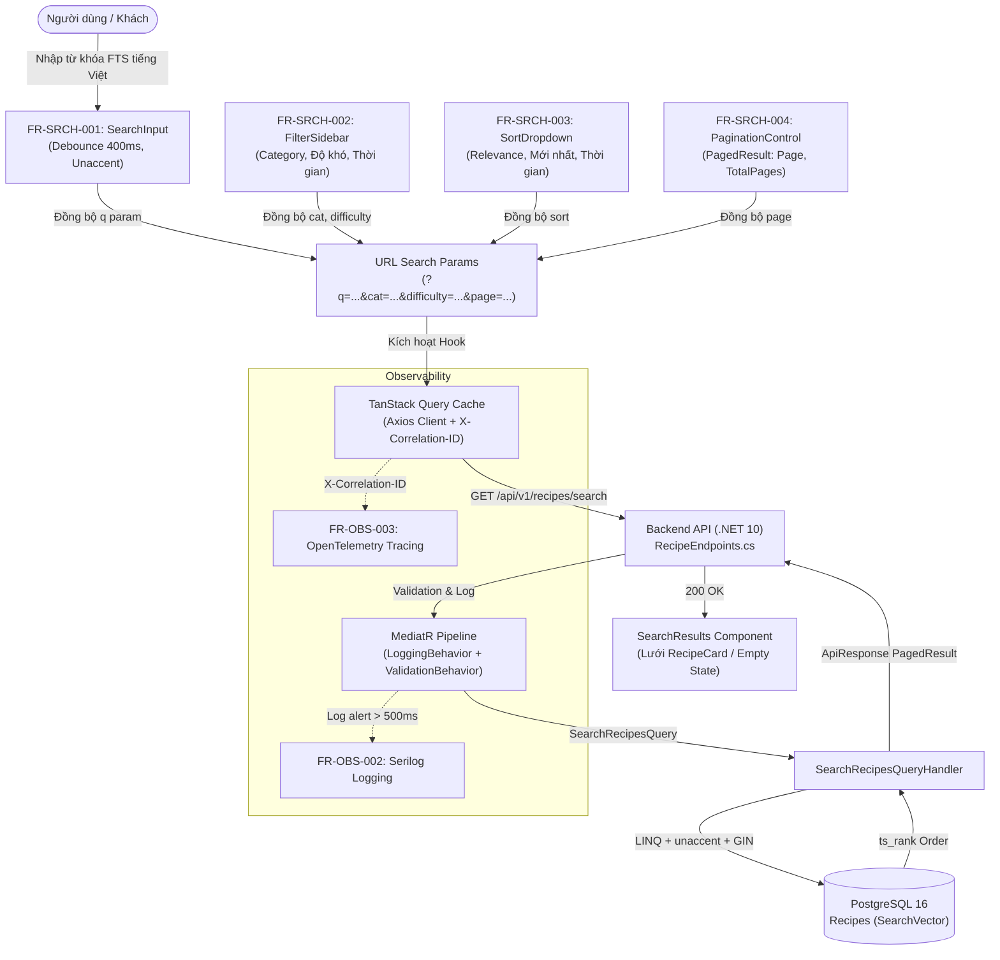

# Đặc Tả Kỹ Thuật Chi Tiết Chức Năng FR-SRCH-001: Tìm Kiếm Toàn Văn Bản (Full-Text Search)

**Dự án:** Culinary Blog – Blog Ẩm thực và Nấu ăn (Nhóm 5)  
**Tài liệu tham chiếu:** 
- `docx/SRS_Culinary_Blog_v1.0.0.pdf` (Chương 3 - Mục 3.4; Chương 7 - Mục 7.2; Chương 8 - Mục 8.3)
- `docx/Spec/Culinary_Blog_Spec.md` (Mục 4, Mục 6, Mục 7.4)
- `docx/Spec/Frontend_Spec.md` & `frontend.md` (Mục 1, Mục 2, Mục 3.3, Mục 4, Mục 5, Mục 6)
- `docx/Spec/struc.md` & `struc` (Mục 1, Mục 2, Mục 3, Mục 4, Mục 5, Mục 6)  
- **Thư mục Migration thực tế:** `src/CulinaryBlog.Infrastructure/Persistence/Migrations/`
  - `20260922024902_InitialCreate.cs`
  - `20260922024902_InitialCreate.Designer.cs`
  - `ApplicationDbContextModelSnapshot.cs`  
- **Mã nguồn thực tế:** `UnitOfWork.cs`, `Recipe.cs`, `RecipeConfiguration.cs`, `RecipeRepository.cs`, `ApiResponse.cs`, `PagedResult.cs`, `LoggingBehavior.cs`, `ValidationBehavior.cs`, `GlobalExceptionMiddleware.cs`  
**Thành viên phụ trách:** **Tuấn (Thành viên 3)**  
**Trạng thái:** Sẵn sàng Triển khai (Ready for Implementation)  
**Phiên bản:** 1.2.0  
**Ngày cập nhật:** 2026-09-23  

---

## 1. Tổng Quan Nghiệp Vụ (Business Overview)

### 1.1. Mã Định Danh và Định Nghĩa
- **Mã yêu cầu:** `FR-SRCH-001`
- **Tên yêu cầu:** Tìm kiếm Toàn văn bản Công thức Nấu ăn (Full-Text Search - FTS)
- **Phân hệ:** Module Tìm kiếm và Phân trang (`FR-SRCH`)
- **Mức độ ưu tiên (MoSCoW):** **Must Have (M)** – Bắt buộc trong phiên bản 1.0.0.
- **Tác nhân (Actor):** Tất cả người dùng:
  - Khách vãng lai (`Guest / Anonymous`): Tra cứu công thức tự do, không cần đăng nhập.
  - Tác giả (`Author`): Tra cứu, tìm kiếm ý tưởng công thức đã xuất bản.
  - Quản trị viên (`Admin`): Tra cứu, quản lý và kiểm duyệt công thức trên toàn hệ thống.

### 1.2. Mục Tiêu Nghiệp Vụ
1. **Tìm kiếm ngôn ngữ tự nhiên tiếng Việt:** Vượt trội hơn tìm kiếm chuỗi thông thường (`LIKE %keyword%`). Cho phép tìm kiếm chính xác công thức nấu ăn dù người dùng gõ **có dấu** hoặc **không dấu** (ví dụ: gõ `"pho bo"` hoặc `"phở bò"` đều tìm ra `"Phở bò Nam Định"`).
2. **Xếp hạng độ liên quan (Relevance Ranking):** Các kết quả có mức độ trùng khớp cao ở trường Tiêu đề (`Title` - trọng số A) và trường Mô tả (`Description` - trọng số B) được đưa lên đầu danh sách dựa trên thuật toán `ts_rank()`.
3. **Phạm vi hiển thị an toàn:** **Chỉ áp dụng tìm kiếm đối với các công thức có trạng thái `Published` và chưa bị xóa (`IsDeleted == false`)**. Các công thức ở trạng thái Bản nháp (`Draft`) hoặc Lưu trữ (`Archived`) tuyệt đối không xuất hiện trong kết quả tìm kiếm công cộng.
4. **Phản hồi không tìm thấy thân thiện:** Khi không có dữ liệu khớp, trả về danh sách rỗng (HTTP 200 OK kèm `items: []`) và gợi ý từ khóa thay thế, không phát sinh lỗi HTTP 404.
5. **Tiết kiệm tài nguyên và bảo vệ hệ thống:** 
   - Phía Frontend áp dụng cơ chế **Debounce 400ms** để triệt tiêu tình trạng spam request theo từng phím gõ.
   - Phía Backend áp dụng xử lý lọc ký tự độc hại (Sanitization) và Parameterization để loại bỏ rủi ro SQL Injection hoặc lỗi cú pháp `tsquery`.

---

## 2. Phân Tích Hiện Trạng Database Qua Thư Mục Migrations

Dựa trên phân tích trực tiếp mã nguồn trong `src/CulinaryBlog.Infrastructure/Persistence/Migrations/`:

### 2.1. Đánh Giá Tệp `20260922024902_InitialCreate.cs`
1. **Phần đã có (Assets Ready):**
   - Đã khai báo và áp dụng 2 extension cần thiết cho PostgreSQL:
     ```csharp
     migrationBuilder.AlterDatabase()
         .Annotation("Npgsql:PostgresExtension:pg_trgm", ",,")
         .Annotation("Npgsql:PostgresExtension:unaccent", ",,");
     ```
   - Bảng `Recipes` đã được tạo với các cột thực tế:
     - `Id` (`uuid`, PK)
     - `Title` (`character varying(200)`, NOT NULL)
     - `Slug` (`character varying(220)`, NOT NULL, Unique Index `IX_Recipes_Slug`)
     - `Description` (`text`, NOT NULL)
     - `Instructions` (`text`, NOT NULL)
     - `PrepTime` (`integer`, NOT NULL) — *Lưu ý quan trọng: tên cột C# & DB là `PrepTime`, không phải `PrepTimeMinutes`*
     - `CookTime` (`integer`, NOT NULL) — *Lưu ý quan trọng: tên cột C# & DB là `CookTime`, không phải `CookTimeMinutes`*
     - `Servings` (`integer`, NOT NULL)
     - `Difficulty` (`smallint`, NOT NULL, Index `IX_Recipes_Difficulty`)
     - `Status` (`smallint`, NOT NULL, Index `IX_Recipes_Status`)
     - `PublishedAt` (`timestamp with time zone`, NULL)
     - `CategoryId` (`uuid`, NOT NULL, FK đến `Categories.Id`, Index `IX_Recipes_CategoryId`)
     - `AuthorId` (`text`, NOT NULL, FK đến `AspNetUsers.Id`, Index `IX_Recipes_AuthorId`)
     - Các cột Owned Entity Nutrition: `Nutrition_Calories`, `Nutrition_Protein`, `Nutrition_Carbohydrates`, `Nutrition_Fat`, `Nutrition_Fiber`, `Nutrition_Sodium` (`numeric(8,2)`)
     - `CreatedAt` (`timestamp with time zone`, NOT NULL)
     - `UpdatedAt` (`timestamp with time zone`, NULL)
     - `IsDeleted` (`boolean`, NOT NULL)
     - `RowVersion` (`bytea`, rowVersion concurrency token)
2. **Khoảng cách kỹ thuật còn thiếu (Technical Gaps for FR-SRCH-001):**
   - ❌ Trong `InitialCreate`, **chưa có cột `SearchVector`** trong bảng `Recipes`.
   - ❌ **Chưa có chỉ mục GIN** trên cột `SearchVector`.
   - ❌ **Chưa có Trigger Function** tự động sinh `SearchVector` khi `Title` hoặc `Description` thay đổi.
   - ❌ Trong `ApplicationDbContextModelSnapshot.cs`, thực thể `Recipe` chưa khai báo ánh xạ thuộc tính `SearchVector`.

### 2.2. Giải Pháp Migration Bổ Sung Bắt Buộc: `AddSearchVectorToRecipes`
Để hoàn thiện cơ sở dữ liệu cho chức năng FTS mà không làm ảnh hưởng đến dữ liệu hiện có trong `InitialCreate`, cần tạo một Migration kế tiếp mang tên:  
`AddSearchVectorToRecipes` (hoặc `20260923_AddSearchVectorToRecipes.cs`).

Nội dung chi tiết của Migration mới:
```csharp
using Microsoft.EntityFrameworkCore.Migrations;

#nullable disable

namespace CulinaryBlog.Infrastructure.Persistence.Migrations
{
    /// <inheritdoc />
    public partial class AddSearchVectorToRecipes : Migration
    {
        /// <inheritdoc />
        protected override void Up(MigrationBuilder migrationBuilder)
        {
            // 1. Thêm cột SearchVector kiểu tsvector vào bảng Recipes
            migrationBuilder.AddColumn<NpgsqlTypes.NpgsqlTsVector>(
                name: "SearchVector",
                table: "Recipes",
                type: "tsvector",
                nullable: true);

            // 2. Tạo PostgreSQL Trigger Function: Kết hợp unaccent() để loại bỏ dấu tiếng Việt,
            // gán trọng số 'A' cho Title và 'B' cho Description
            migrationBuilder.Sql(@"
                CREATE OR REPLACE FUNCTION recipes_search_vector_update() RETURNS trigger AS $$
                BEGIN
                  NEW.""SearchVector"" :=
                    setweight(to_tsvector('simple', unaccent(coalesce(NEW.""Title"", ''))), 'A') ||
                    setweight(to_tsvector('simple', unaccent(coalesce(NEW.""Description"", ''))), 'B');
                  RETURN NEW;
                END
                $$ LANGUAGE plpgsql;
            ");

            // 3. Tạo Trigger kích hoạt trước khi INSERT hoặc UPDATE trên Title / Description
            migrationBuilder.Sql(@"
                DROP TRIGGER IF EXISTS trg_recipes_search_vector_update ON ""Recipes"";
                CREATE TRIGGER trg_recipes_search_vector_update
                BEFORE INSERT OR UPDATE OF ""Title"", ""Description"" ON ""Recipes""
                FOR EACH ROW EXECUTE FUNCTION recipes_search_vector_update();
            ");

            // 4. Tạo chỉ mục Generalized Inverted Index (GIN) trên cột SearchVector
            migrationBuilder.CreateIndex(
                name: "IX_Recipes_SearchVector",
                table: "Recipes",
                column: "SearchVector")
                .Annotation("Npgsql:IndexMethod", "GIN");

            // 5. Đồng bộ dữ liệu vector cho tất cả các bản ghi Recipe hiện có
            migrationBuilder.Sql(@"
                UPDATE ""Recipes""
                SET ""SearchVector"" =
                    setweight(to_tsvector('simple', unaccent(coalesce(""Title"", ''))), 'A') ||
                    setweight(to_tsvector('simple', unaccent(coalesce(""Description"", ''))), 'B');
            ");
        }

        /// <inheritdoc />
        protected override void Down(MigrationBuilder migrationBuilder)
        {
            // Xóa Trigger
            migrationBuilder.Sql(@"DROP TRIGGER IF EXISTS trg_recipes_search_vector_update ON ""Recipes"";");

            // Xóa Trigger Function
            migrationBuilder.Sql(@"DROP FUNCTION IF EXISTS recipes_search_vector_update();");

            // Xóa Index GIN
            migrationBuilder.DropIndex(
                name: "IX_Recipes_SearchVector",
                table: "Recipes");

            // Xóa Cột SearchVector
            migrationBuilder.DropColumn(
                name: "SearchVector",
                table: "Recipes");
        }
    }
}
```

---

## 3. Ma Trận Ánh Xạ Cấu Trúc Mã Nguồn (Codebase Architecture Mapping)

Dựa trên tài liệu `struc.md` và mã nguồn thực tế trong `src/` và `culinary-blog-web/`:

### 3.1. Backend Clean Architecture (`src/`)

| Tầng kiến trúc | Đường dẫn tệp tin | Lớp / Thành phần | Hiện trạng & Điều chỉnh cho FR-SRCH-001 |
| :--- | :--- | :--- | :--- |
| **Domain** | `src/CulinaryBlog.Domain/Common/BaseEntity.cs` | `BaseEntity` | Đã có: cung cấp `Id`, `CreatedAt`, `UpdatedAt`, `IsDeleted`, `RowVersion`. |
| **Domain** | `src/CulinaryBlog.Domain/Entities/Recipe.cs` | `Recipe` | Cần thêm: thuộc tính `public NpgsqlTsVector? SearchVector { get; set; }`. |
| **Domain** | `src/CulinaryBlog.Domain/Enums/RecipeEnums.cs` | `RecipeStatus`, `RecipeDifficulty` | Đã có: `RecipeStatus.Published (1)`, `RecipeDifficulty`. |
| **Domain** | `src/CulinaryBlog.Domain/Interfaces/IRecipeRepository.cs` | `IRecipeRepository` | Cần bổ sung chữ ký: `SearchRecipesAsync(...)`. |
| **Domain** | `src/CulinaryBlog.Domain/Interfaces/IUnitOfWork.cs` | `IUnitOfWork` | Đã có: sở hữu property `IRecipeRepository Recipes { get; }`. |
| **Application** | `src/CulinaryBlog.Application/Common/Models/PagedResult.cs` | `PagedResult<T>` | Đã có: model phân trang `{ items, totalCount, page, pageSize, totalPages, hasNextPage, hasPreviousPage }`. |
| **Application** | `src/CulinaryBlog.Application/Common/Models/ApiResponse.cs` | `ApiResponse<T>` | Đã có: wrapper `{ success, message, data }`, sử dụng helper `ApiResponse<T>.Ok(data, message)`. |
| **Application** | `src/CulinaryBlog.Application/Common/Behaviors/LoggingBehavior.cs` | `LoggingBehavior<TRequest, TResponse>` | Đã có: tự động đo thời gian và cảnh báo `LogWarning` khi query > 500ms. |
| **Application** | `src/CulinaryBlog.Application/Common/Behaviors/ValidationBehavior.cs` | `ValidationBehavior<TRequest, TResponse>` | Đã có: tự động ném `DomainValidationException(failures)` khi validation thất bại. |
| **Application** | `src/CulinaryBlog.Application/DTOs/RecipeSummaryDto.cs` | `RecipeSummaryDto` | Cần tạo mới: DTO tóm tắt món ăn hiển thị trong kết quả tìm kiếm (kèm `RelevanceScore`). |
| **Application** | `src/CulinaryBlog.Application/Features/Recipes/Queries/SearchRecipes/SearchRecipesQuery.cs` | `SearchRecipesQuery`, `SearchRecipesQueryValidator`, `SearchRecipesQueryHandler` | Cần tạo mới: Use case xử lý tìm kiếm FTS theo pattern CQRS của hệ thống. |
| **Infrastructure** | `src/CulinaryBlog.Infrastructure/Persistence/ApplicationDbContext.cs` | `ApplicationDbContext` | Đã có: extension `unaccent` và `pg_trgm`. |
| **Infrastructure** | `src/CulinaryBlog.Infrastructure/Persistence/Configurations/RecipeConfiguration.cs` | `RecipeConfiguration` | Cần thêm: cấu hình `SearchVector` và chỉ mục GIN `IX_Recipes_SearchVector`. |
| **Infrastructure** | `src/CulinaryBlog.Infrastructure/Repositories/RecipeRepository.cs` | `RecipeRepository` | Cần thêm: hiện thực hóa `SearchRecipesAsync(...)` với `EF.Functions.ToTsQuery` và `ts_rank`. |
| **Infrastructure** | `src/CulinaryBlog.Infrastructure/Persistence/UnitOfWork.cs` | `UnitOfWork` | Đã có: cung cấp `Recipes` và `SaveChangesAsync`. |
| **Presentation** | `src/CulinaryBlog.API/Endpoints/RecipeEndpoints.cs` | `RecipeEndpoints` | Cần bổ sung endpoint: `group.MapGet("/search", ...)`. |
| **Presentation** | `src/CulinaryBlog.API/Middlewares/CorrelationIdMiddleware.cs` | `CorrelationIdMiddleware` | Đã có: đọc hoặc tạo mã `X-Correlation-ID`. |
| **Presentation** | `src/CulinaryBlog.API/Middlewares/GlobalExceptionMiddleware.cs` | `GlobalExceptionMiddleware` | Đã có: tự động bắt `ValidationException` trả về HTTP 422 Problem Details (RFC 7807). |

### 3.2. Frontend Web Next.js 16 (`culinary-blog-web/`)

| Phân hệ Frontend | Đường dẫn tệp tin | Thành phần / Module | Vai trò trong FR-SRCH-001 |
| :--- | :--- | :--- | :--- |
| **App Routing** | `app/(public)/search/page.tsx` | Search Page (`/search`) | Trang điều phối tìm kiếm, kết hợp URL searchParams và TanStack Query. |
| **Components** | `components/search/SearchInput.tsx` | `SearchInput` | **Component trung tâm của FR-SRCH-001**: Ô nhập debounce 400ms, phím tắt `/`, nút Clear `X`, loading indicator. |
| **Components** | `components/search/SearchResults.tsx` | `SearchResults` | Hiển thị số lượng tìm thấy ("Tìm thấy X kết quả"), danh sách card hoặc Empty State khi không có kết quả. |
| **Components** | `components/search/FilterSidebar.tsx` | `FilterSidebar` | Lọc kết hợp danh mục, độ khó, thời gian nấu (FR-SRCH-002). |
| **Components** | `components/search/SortDropdown.tsx` | `SortDropdown` | Sắp xếp theo Relevance rank, Mới nhất, Thời gian nấu (FR-SRCH-003). |
| **Components** | `components/search/PaginationControl.tsx` | `PaginationControl` | Điều khiển phân trang PagedResult (FR-SRCH-004). |
| **Components** | `components/recipes/RecipeCard.tsx` | `RecipeCard` | Card hiển thị từng món ăn tìm thấy (ảnh đại diện, thời gian, calo, tác giả). |
| **API Client** | `lib/api/axiosClient.ts` | `axiosClient` | Cấu hình BaseURL `/api/v1`, tự động gắn `X-Correlation-ID` vào request header. |
| **API Client** | `lib/api/recipeApi.ts` | `searchRecipes()` | Hàm gọi `GET /api/v1/recipes/search` sử dụng `axiosClient`. |
| **Logging** | `lib/logger.ts` | `logger` | Ghi log structured JSON tại client với correlationId, query string và thời gian phản hồi. |
| **Types** | `types/recipe.types.ts` | `RecipeSummaryDto` | Interface TypeScript định nghĩa cấu trúc món ăn trả về. |
| **Types** | `types/api.types.ts` | `ApiResponse<T>`, `PagedResult<T>`, `ProblemDetails` | Interface chuẩn hóa dữ liệu phản hồi và thông báo lỗi RFC 7807. |

---

## 4. Đặc Tả Giao Diện Lập Trình Ứng Dụng (REST API Contract)

### 4.1. Thông Tin Endpoint
- **HTTP Method:** `GET`
- **Đường dẫn URL:** `/api/v1/recipes/search`
- **Phân quyền truy cập:** **Public** (Không yêu cầu xác thực JWT).
- **Mã hóa nội dung:** `application/json; charset=utf-8`

### 4.2. Tham Số Truy Vấn (Query Parameters)
| Tham số | Kiểu dữ liệu | Bắt buộc | Mặc định | Giới hạn & Mô tả |
| :--- | :--- | :---: | :---: | :--- |
| `q` | `string` | **Có** | - | Từ khóa tìm kiếm FTS tiếng Việt có/không dấu (tối thiểu 2, tối đa 100 ký tự). |
| `page` | `integer` | Không | `1` | Số thứ tự trang hiện tại (`page >= 1`). |
| `pageSize` | `integer` | Không | `12` | Số lượng bản ghi trên một trang (`1 <= pageSize <= 50`). |
| `categoryId` | `uuid` | Không | `null` | Lọc theo danh mục món ăn cụ thể (`Category.Id`). |
| `difficulty` | `integer` | Không | `null` | Lọc theo độ khó: `1` (Easy), `2` (Medium), `3` (Hard), `4` (Expert). |
| `sort` | `string` | Không | `relevance` | Tiêu chí sắp xếp: `relevance` (mặc định), `-createdAt`, `createdAt`, `cookTime`, `-cookTime`, `title`. |

### 4.3. HTTP Headers
- **Request Header:**
  - `X-Correlation-ID` *(Tùy chọn)*: Mã UUID định danh phiên gọi API do Client sinh hoặc Reverse Proxy chuyển tiếp.
- **Response Headers:**
  - `X-Correlation-ID`: Trả lại đúng UUID phục vụ đối chiếu log client-server (FR-OBS-003).
  - `Content-Type`: `application/json; charset=utf-8`
  - `Cache-Control`: `public, max-age=60` (hoặc cấu hình Redis cache ngắn hạn 1-5 phút).

### 4.4. Định Dạng Phản Hồi Thành Công (HTTP 200 OK)
Theo đúng chuẩn `ApiResponse<T>` (`ApiResponse.Ok(...)`) và `PagedResult<T>` trong `src/CulinaryBlog.Application/Common/Models/`:
```json
{
  "success": true,
  "message": "Tìm kiếm công thức thành công.",
  "data": {
    "items": [
      {
        "id": "e6a2b8e3-0d3a-4e2b-b5d1-123456789abc",
        "title": "Phở Bò Nam Định Chuẩn Vị Gia Truyền",
        "slug": "pho-bo-nam-dinh-chuan-vi-gia-truyen",
        "description": "Bí quyết ninh nước dùng trong veo, ngọt thanh từ xương ống bò và thảo mộc truyền thống.",
        "primaryImageUrl": "http://localhost:9000/culinary-blog/recipes/e6a2b8e3-0d3a-4e2b-b5d1-123456789abc/thumb_300.webp",
        "category": {
          "id": "c1f7b8e3-1111-2222-3333-abcdef123456",
          "name": "Món Nước & Súp",
          "slug": "mon-nuoc-va-sup"
        },
        "author": {
          "id": "usr_987654321",
          "displayName": "Chef Nguyễn Văn Tuấn",
          "avatarUrl": "http://localhost:9000/culinary-blog/avatars/tuan.webp"
        },
        "difficulty": "Medium",
        "prepTime": 30,
        "cookTime": 180,
        "servings": 4,
        "relevanceScore": 0.825,
        "createdAt": "2026-09-20T08:30:00Z"
      }
    ],
    "totalCount": 1,
    "page": 1,
    "pageSize": 12,
    "totalPages": 1,
    "hasNextPage": false,
    "hasPreviousPage": false
  }
}
```

### 4.5. Định Dạng Phản Hồi Lỗi Chuẩn RFC 7807 (Problem Details)
Xử lý bởi `GlobalExceptionMiddleware.cs`:
- **Lỗi 422 Unprocessable Entity** (Từ khóa `q` không hợp lệ):
  ```json
  {
    "type": "https://tools.ietf.org/html/rfc7231#section-6.5.1",
    "title": "Dữ liệu không hợp lệ.",
    "status": 422,
    "detail": "Một hoặc nhiều lỗi xác thực đã xảy ra.",
    "instance": "/api/v1/recipes/search",
    "errors": {
      "Q": ["Từ khóa tìm kiếm phải có tối thiểu 2 ký tự."]
    },
    "correlationId": "018e6a2b-8e30-7d3a-9e2b-b5d112345678"
  }
  ```
- **Lỗi 500 Internal Server Error** (Lỗi hệ thống hoặc kết nối cơ sở dữ liệu):
  ```json
  {
    "type": "https://tools.ietf.org/html/rfc7231#section-6.6.1",
    "title": "Lỗi hệ thống.",
    "status": 500,
    "detail": "Đã xảy ra lỗi không mong muốn trên máy chủ.",
    "instance": "/api/v1/recipes/search",
    "correlationId": "018e6a2b-8e30-7d3a-9e2b-b5d112345678"
  }
  ```

---

## 5. Thiết Kế Backend Clean Architecture (.NET 10 Minimal APIs)

### 5.1. Cập Nhật Tầng Domain (`CulinaryBlog.Domain`)

1. **`Entities/Recipe.cs`**:
   Bổ sung thuộc tính `SearchVector` sử dụng kiểu dữ liệu `NpgsqlTsVector` từ gói `NpgsqlTypes`:
   ```csharp
   using NpgsqlTypes;

   namespace CulinaryBlog.Domain.Entities;

   public class Recipe : BaseEntity
   {
       // Các thuộc tính hiện có: Title, Slug, Description, Instructions, PrepTime, CookTime...

       /// <summary>
       /// Vector tìm kiếm toàn văn bản PostgreSQL tsvector (FR-SRCH-001)
       /// Cập nhật tự động bởi database trigger 'trg_recipes_search_vector_update'
       /// </summary>
       public NpgsqlTsVector? SearchVector { get; set; }

       // ...
   }
   ```

2. **`Interfaces/IRecipeRepository.cs`**:
   Bổ sung khai báo phương thức tìm kiếm chuyên biệt:
   ```csharp
   public interface IRecipeRepository : IRepository<Recipe>
   {
       // Các phương thức hiện có: GetBySlugAsync, GetDetailsByIdAsync, ExistsBySlugAsync, CountByCategoryIdAsync, GetPagedAsync...

       /// <summary>
       /// Tìm kiếm toàn văn bản công thức nấu ăn (FR-SRCH-001)
       /// </summary>
       Task<(IReadOnlyList<Recipe> Items, int TotalCount, Dictionary<Guid, double> RelevanceScores)> SearchRecipesAsync(
           string sanitizedTsQuery,
           int page,
           int pageSize,
           Guid? categoryId = null,
           RecipeDifficulty? difficulty = null,
           string? sortBy = null,
           CancellationToken ct = default);
   }
   ```

### 5.2. Cập Nhật Tầng Application (`CulinaryBlog.Application`)

1. **`DTOs/RecipeSummaryDto.cs`**:
   Tạo tệp DTO mới trong `src/CulinaryBlog.Application/DTOs/`:
   ```csharp
   using System;

   namespace CulinaryBlog.Application.DTOs;

   public class RecipeSummaryDto
   {
       public Guid Id { get; set; }
       public string Title { get; set; } = string.Empty;
       public string Slug { get; set; } = string.Empty;
       public string Description { get; set; } = string.Empty;
       public string? PrimaryImageUrl { get; set; }
       public CategorySummaryDto Category { get; set; } = null!;
       public AuthorSummaryDto Author { get; set; } = null!;
       public string Difficulty { get; set; } = string.Empty;
       public int PrepTime { get; set; }
       public int CookTime { get; set; }
       public int Servings { get; set; }
       public double RelevanceScore { get; set; }
       public DateTime CreatedAt { get; set; }
   }

   public class CategorySummaryDto
   {
       public Guid Id { get; set; }
       public string Name { get; set; } = string.Empty;
       public string Slug { get; set; } = string.Empty;
   }

   public class AuthorSummaryDto
   {
       public string Id { get; set; } = string.Empty;
       public string DisplayName { get; set; } = string.Empty;
       public string? AvatarUrl { get; set; }
   }
   ```

2. **`Features/Recipes/Queries/SearchRecipes/SearchRecipesQuery.cs`**:
   Tuân theo pattern của `GetCategoriesQuery.cs` và `CreateCategoryCommand.cs`: gom Query, Validator và Handler cùng một tệp (hoặc cùng thư mục):
   ```csharp
   using System;
   using System.Collections.Generic;
   using System.Linq;
   using System.Text;
   using System.Text.RegularExpressions;
   using System.Threading;
   using System.Threading.Tasks;
   using CulinaryBlog.Application.Common.Models;
   using CulinaryBlog.Application.DTOs;
   using CulinaryBlog.Domain.Enums;
   using CulinaryBlog.Domain.Interfaces;
   using FluentValidation;
   using MediatR;

   namespace CulinaryBlog.Application.Features.Recipes.Queries.SearchRecipes;

   public record SearchRecipesQuery : IRequest<ApiResponse<PagedResult<RecipeSummaryDto>>>
   {
       public string Q { get; init; } = string.Empty;
       public int Page { get; init; } = 1;
       public int PageSize { get; init; } = 12;
       public Guid? CategoryId { get; init; }
       public RecipeDifficulty? Difficulty { get; init; }
       public string? Sort { get; init; } = "relevance";
   }

   public class SearchRecipesQueryValidator : AbstractValidator<SearchRecipesQuery>
   {
       public SearchRecipesQueryValidator()
       {
           RuleFor(x => x.Q)
               .NotEmpty().WithMessage("Từ khóa tìm kiếm không được để trống.")
               .MinimumLength(2).WithMessage("Từ khóa tìm kiếm phải có tối thiểu 2 ký tự.")
               .MaximumLength(100).WithMessage("Từ khóa tìm kiếm không được vượt quá 100 ký tự.");

           RuleFor(x => x.Page)
               .GreaterThanOrEqualTo(1).WithMessage("Số trang phải lớn hơn hoặc bằng 1.");

           RuleFor(x => x.PageSize)
               .InclusiveBetween(1, 50).WithMessage("Kích thước trang phải nằm trong khoảng từ 1 đến 50.");
       }
   }

   public class SearchRecipesQueryHandler : IRequestHandler<SearchRecipesQuery, ApiResponse<PagedResult<RecipeSummaryDto>>>
   {
       private readonly IUnitOfWork _unitOfWork;

       public SearchRecipesQueryHandler(IUnitOfWork unitOfWork)
       {
           _unitOfWork = unitOfWork;
       }

       public async Task<ApiResponse<PagedResult<RecipeSummaryDto>>> Handle(
           SearchRecipesQuery request, 
           CancellationToken cancellationToken)
       {
           // 1. Chuyển đổi và làm sạch từ khóa thành cú pháp tsquery prefix matching
           var tsQuery = BuildTsQueryString(request.Q);

           // 2. Thực thi truy vấn qua Repository trong UnitOfWork
           var (recipes, totalCount, scores) = await _unitOfWork.Recipes.SearchRecipesAsync(
               tsQuery,
               request.Page,
               request.PageSize,
               request.CategoryId,
               request.Difficulty,
               request.Sort,
               cancellationToken);

           // 3. Ánh xạ sang RecipeSummaryDto
           var dtos = recipes.Select(r =>
           {
               var primaryImage = r.Images.FirstOrDefault(img => img.IsPrimary) ?? r.Images.FirstOrDefault();
               scores.TryGetValue(r.Id, out var rankScore);

               return new RecipeSummaryDto
               {
                   Id = r.Id,
                   Title = r.Title,
                   Slug = r.Slug,
                   Description = r.Description,
                   PrimaryImageUrl = primaryImage?.ThumbnailUrl ?? primaryImage?.MediumUrl ?? primaryImage?.OriginalUrl,
                   Category = new CategorySummaryDto
                   {
                       Id = r.Category.Id,
                       Name = r.Category.Name,
                       Slug = r.Category.Slug
                   },
                   Author = new AuthorSummaryDto
                   {
                       Id = r.Author.Id,
                       DisplayName = r.Author.DisplayName,
                       AvatarUrl = r.Author.AvatarUrl
                   },
                   Difficulty = r.Difficulty.ToString(),
                   PrepTime = r.PrepTime,
                   CookTime = r.CookTime,
                   Servings = r.Servings,
                   RelevanceScore = Math.Round(rankScore, 3),
                   CreatedAt = r.CreatedAt
               };
           }).ToList();

           var pagedResult = new PagedResult<RecipeSummaryDto>(dtos, totalCount, request.Page, request.PageSize);

           return ApiResponse<PagedResult<RecipeSummaryDto>>.Ok(
               pagedResult, 
               "Tìm kiếm công thức thành công.");
       }

       private static string BuildTsQueryString(string term)
       {
           if (string.IsNullOrWhiteSpace(term)) return string.Empty;

           var unaccented = RemoveDiacritics(term);
           var words = Regex.Split(unaccented, @"[^\w]+")
                            .Where(w => !string.IsNullOrWhiteSpace(w))
                            .Select(w => $"'{w}':*");

           return string.Join(" & ", words);
       }

       private static string RemoveDiacritics(string text)
       {
           var normalizedString = text.Normalize(NormalizationForm.FormD);
           var sb = new StringBuilder();

           foreach (var c in normalizedString)
           {
               var uc = System.Globalization.CharUnicodeInfo.GetUnicodeCategory(c);
               if (uc != System.Globalization.UnicodeCategory.NonSpacingMark)
               {
                   sb.Append(c);
               }
           }

           return sb.ToString().Normalize(NormalizationForm.FormC).ToLowerInvariant();
       }
   }
   ```

### 5.3. Cập Nhật Tầng Infrastructure (`CulinaryBlog.Infrastructure`)

1. **`Persistence/Configurations/RecipeConfiguration.cs`**:
   Bổ sung cấu hình cột `SearchVector` và chỉ mục GIN:
   ```csharp
   // Bổ sung vào RecipeConfiguration.Configure()
   builder.Property(r => r.SearchVector)
          .HasColumnType("tsvector");

   builder.HasIndex(r => r.SearchVector)
          .HasMethod("GIN")
          .HasDatabaseName("IX_Recipes_SearchVector");
   ```

2. **`Repositories/RecipeRepository.cs`**:
   Hiện thực phương thức `SearchRecipesAsync`:
   ```csharp
   public async Task<(IReadOnlyList<Recipe> Items, int TotalCount, Dictionary<Guid, double> RelevanceScores)> SearchRecipesAsync(
       string sanitizedTsQuery,
       int page,
       int pageSize,
       Guid? categoryId = null,
       RecipeDifficulty? difficulty = null,
       string? sortBy = null,
       CancellationToken ct = default)
   {
       var query = _dbSet
           .Include(r => r.Category)
           .Include(r => r.Author)
           .Include(r => r.Images)
           .AsNoTracking()
           .Where(r => r.Status == RecipeStatus.Published && !r.IsDeleted);

       // 1. Áp dụng Full-Text Search tsvector matching
       if (!string.IsNullOrWhiteSpace(sanitizedTsQuery))
       {
           query = query.Where(r => r.SearchVector!.Matches(EF.Functions.ToTsQuery("simple", sanitizedTsQuery)));
       }

       // 2. Lọc bổ sung (FR-SRCH-002)
       if (categoryId.HasValue)
       {
           query = query.Where(r => r.CategoryId == categoryId.Value);
       }

       if (difficulty.HasValue)
       {
           query = query.Where(r => r.Difficulty == difficulty.Value);
       }

       // 3. Đếm tổng số bản ghi
       int totalCount = await query.CountAsync(ct);

       // 4. Sắp xếp (FR-SRCH-003)
       if (string.IsNullOrEmpty(sortBy) || sortBy.Equals("relevance", StringComparison.OrdinalIgnoreCase))
       {
           if (!string.IsNullOrWhiteSpace(sanitizedTsQuery))
           {
               query = query.OrderByDescending(r => r.SearchVector!.Rank(EF.Functions.ToTsQuery("simple", sanitizedTsQuery)));
           }
           else
           {
               query = query.OrderByDescending(r => r.CreatedAt);
           }
       }
       else
       {
           query = sortBy.ToLowerInvariant() switch
           {
               "-createdat" => query.OrderByDescending(r => r.CreatedAt),
               "createdat" => query.OrderBy(r => r.CreatedAt),
               "cooktime" => query.OrderBy(r => r.CookTime),
               "-cooktime" => query.OrderByDescending(r => r.CookTime),
               "title" => query.OrderBy(r => r.Title),
               _ => query.OrderByDescending(r => r.CreatedAt)
           };
       }

       // 5. Phân trang
       var items = await query
           .Skip((page - 1) * pageSize)
           .Take(pageSize)
           .ToListAsync(ct);

       // 6. Tính toán điểm Relevance Score
       var scores = new Dictionary<Guid, double>();
       if (!string.IsNullOrWhiteSpace(sanitizedTsQuery) && items.Count > 0)
       {
           var itemIds = items.Select(x => x.Id).ToList();
           var rankData = await _dbSet
               .Where(r => itemIds.Contains(r.Id))
               .Select(r => new
               {
                   r.Id,
                   Score = (double)r.SearchVector!.Rank(EF.Functions.ToTsQuery("simple", sanitizedTsQuery))
               })
               .ToListAsync(ct);

           scores = rankData.ToDictionary(x => x.Id, x => x.Score);
       }

       return (items, totalCount, scores);
   }
   ```

### 5.4. Cập Nhật Tầng Presentation (`CulinaryBlog.API/Endpoints/RecipeEndpoints.cs`)

Bổ sung endpoint tìm kiếm vào `RecipeEndpoints.cs`:
```csharp
using System;
using CulinaryBlog.Application.Common.Models;
using CulinaryBlog.Application.DTOs;
using CulinaryBlog.Application.Features.Recipes.Queries.SearchRecipes;
using CulinaryBlog.Domain.Enums;
using CulinaryBlog.Domain.Interfaces;
using MediatR;
using Microsoft.AspNetCore.Builder;
using Microsoft.AspNetCore.Http;
using Microsoft.AspNetCore.Mvc;
using Microsoft.AspNetCore.Routing;

namespace CulinaryBlog.API.Endpoints;

public static class RecipeEndpoints
{
    public static IEndpointRouteBuilder MapRecipeEndpoints(this IEndpointRouteBuilder app)
    {
        var group = app.MapGroup("/api/v1/recipes")
            .WithTags("Recipes");

        // FR-RCP-001: Xem Danh sách Công thức (Paginated + Filtered)
        group.MapGet("/", async (
            int? page,
            int? pageSize,
            Guid? categoryId,
            string? sortBy,
            IRecipeRepository recipeRepo) =>
        {
            int p = page.GetValueOrDefault(1);
            int ps = pageSize.GetValueOrDefault(12);
            var (items, totalCount) = await recipeRepo.GetPagedAsync(p, ps, categoryId: categoryId, sortBy: sortBy);
            return Results.Ok(new
            {
                items,
                totalCount,
                page = p,
                pageSize = ps
            });
        })
        .WithName("GetRecipes")
        .WithSummary("Lấy danh sách công thức đã xuất bản kèm phân trang và lọc");

        // FR-SRCH-001: Tìm kiếm Toàn văn bản Công thức Nấu ăn (Full-Text Search)
        group.MapGet("/search", async (
            [AsParameters] SearchRecipesQuery query,
            ISender sender,
            CancellationToken ct) =>
        {
            var result = await sender.Send(query, ct);
            return Results.Ok(result);
        })
        .WithName("SearchRecipes")
        .WithSummary("Tìm kiếm toàn văn bản công thức nấu ăn (FTS)")
        .WithDescription("Hỗ trợ tìm kiếm tiếng Việt có/không dấu, lọc theo danh mục, độ khó và sắp xếp theo ts_rank.")
        .Produces<ApiResponse<PagedResult<RecipeSummaryDto>>>(StatusCodes.Status200OK)
        .Produces<ProblemDetails>(StatusCodes.Status422UnprocessableEntity);

        return app;
    }
}
```

---

## 6. Thiết Kế Frontend Web Next.js 16 (App Router)

### 6.1. Định Nghĩa Kiểu Dữ Liệu TypeScript (`types/recipe.types.ts` & `types/api.types.ts`)

```typescript
// culinary-blog-web/types/api.types.ts
export interface ApiResponse<T> {
  success: boolean;
  message?: string;
  data: T;
}

export interface PagedResult<T> {
  items: T[];
  totalCount: number;
  page: number;
  pageSize: number;
  totalPages: number;
  hasNextPage: boolean;
  hasPreviousPage: boolean;
}

export interface ProblemDetails {
  type: string;
  title: string;
  status: number;
  detail: string;
  instance?: string;
  errors?: Record<string, string[]>;
  correlationId?: string;
}
```

```typescript
// culinary-blog-web/types/recipe.types.ts
export interface RecipeSummaryDto {
  id: string;
  title: string;
  slug: string;
  description: string;
  primaryImageUrl?: string;
  category: {
    id: string;
    name: string;
    slug: string;
  };
  author: {
    id: string;
    displayName: string;
    avatarUrl?: string;
  };
  difficulty: 'Easy' | 'Medium' | 'Hard' | 'Expert';
  prepTime: number;
  cookTime: number;
  servings: number;
  relevanceScore: number;
  createdAt: string;
}

export interface SearchRecipeParams {
  q: string;
  page?: number;
  pageSize?: number;
  categoryId?: string;
  difficulty?: number;
  sort?: string;
}
```

### 6.2. Hàm Gọi API Client (`lib/api/recipeApi.ts`)
```typescript
// culinary-blog-web/lib/api/recipeApi.ts
import axiosClient from './axiosClient';
import { ApiResponse, PagedResult } from '@/types/api.types';
import { RecipeSummaryDto, SearchRecipeParams } from '@/types/recipe.types';

export const searchRecipes = async (
  params: SearchRecipeParams
): Promise<PagedResult<RecipeSummaryDto>> => {
  const response = await axiosClient.get<ApiResponse<PagedResult<RecipeSummaryDto>>>(
    '/recipes/search',
    { params }
  );
  return response.data.data;
};
```

### 6.3. Axios Client Với Tracing Header (`lib/api/axiosClient.ts`)
Theo `struc.md` (Mục 5.3):
```typescript
// culinary-blog-web/lib/api/axiosClient.ts
import axios from 'axios';
import { v4 as uuidv4 } from 'uuid';

const axiosClient = axios.create({
  baseURL: process.env.NEXT_PUBLIC_API_URL || 'http://localhost:5000/api/v1',
  headers: {
    'Content-Type': 'application/json',
  },
});

axiosClient.interceptors.request.use((config) => {
  // Gán Correlation ID phục vụ distributed tracing (FR-OBS-003)
  if (!config.headers['X-Correlation-ID']) {
    config.headers['X-Correlation-ID'] = uuidv4();
  }
  return config;
});

export default axiosClient;
```

### 6.4. Component Giao Diện `SearchInput.tsx` (FR-SRCH-001)
Thành phần trung tâm của tính năng tìm kiếm do Tuấn (Thành viên 3) phụ trách:
```tsx
// culinary-blog-web/components/search/SearchInput.tsx
'use client';

import React, { useState, useEffect, useRef, useTransition } from 'react';
import { useRouter, useSearchParams, usePathname } from 'next/navigation';
import { Search, X, Loader2 } from 'lucide-react';

interface SearchInputProps {
  placeholder?: string;
  isLoading?: boolean;
}

export const SearchInput: React.FC<SearchInputProps> = ({
  placeholder = "Tìm công thức theo tên món, nguyên liệu (ví dụ: bún bò, sườn nướng...)",
  isLoading = false,
}) => {
  const router = useRouter();
  const pathname = usePathname();
  const searchParams = useSearchParams();
  const inputRef = useRef<HTMLInputElement>(null);
  const [isPending, startTransition] = useTransition();

  const currentQ = searchParams.get('q') || '';
  const [searchTerm, setSearchTerm] = useState(currentQ);

  // Đồng bộ ô input khi URL thay đổi (nhấn nút Back/Forward trên trình duyệt)
  useEffect(() => {
    setSearchTerm(searchParams.get('q') || '');
  }, [searchParams]);

  // Debounce 400ms: Cập nhật URL searchParams khi người dùng dừng gõ 400ms
  useEffect(() => {
    const timer = setTimeout(() => {
      const trimmed = searchTerm.trim();
      const activeQ = searchParams.get('q') || '';

      if (trimmed !== activeQ) {
        const params = new URLSearchParams(searchParams.toString());
        if (trimmed.length >= 2) {
          params.set('q', trimmed);
          params.set('page', '1'); // Reset về trang 1 khi đổi từ khóa
        } else if (trimmed.length === 0) {
          params.delete('q');
          params.set('page', '1');
        }

        startTransition(() => {
          router.replace(`${pathname}?${params.toString()}`, { scroll: false });
        });
      }
    }, 400);

    return () => clearTimeout(timer);
  }, [searchTerm, pathname, router, searchParams]);

  // Phím tắt bàn phím '/' để focus nhanh vào ô tìm kiếm
  useEffect(() => {
    const handleKeyDown = (e: KeyboardEvent) => {
      if (e.key === '/' && document.activeElement !== inputRef.current) {
        e.preventDefault();
        inputRef.current?.focus();
      }
    };
    window.addEventListener('keydown', handleKeyDown);
    return () => window.removeEventListener('keydown', handleKeyDown);
  }, []);

  const handleClear = () => {
    setSearchTerm('');
    const params = new URLSearchParams(searchParams.toString());
    params.delete('q');
    params.set('page', '1');
    router.replace(`${pathname}?${params.toString()}`, { scroll: false });
    inputRef.current?.focus();
  };

  return (
    <div className="relative w-full max-w-2xl mx-auto" role="search">
      <label htmlFor="recipe-search-input" className="sr-only">
        Tìm kiếm công thức nấu ăn
      </label>

      {/* Icon kính lúp hoặc Spinner loading */}
      <div className="absolute inset-y-0 left-0 pl-4 flex items-center pointer-events-none text-gray-400">
        {isLoading || isPending ? (
          <Loader2 className="w-5 h-5 animate-spin text-orange-500" />
        ) : (
          <Search className="w-5 h-5" />
        )}
      </div>

      {/* Input hỗ trợ gõ tiếng Việt mượt mà */}
      <input
        ref={inputRef}
        id="recipe-search-input"
        type="text"
        value={searchTerm}
        onChange={(e) => setSearchTerm(e.target.value)}
        placeholder={placeholder}
        aria-label="Tìm kiếm công thức nấu ăn"
        className="w-full pl-11 pr-24 py-3.5 bg-white dark:bg-gray-800 border border-gray-300 dark:border-gray-700 rounded-full shadow-sm text-gray-900 dark:text-gray-100 placeholder-gray-400 focus:outline-none focus:ring-2 focus:ring-orange-500 focus:border-transparent transition-all duration-200"
      />

      {/* Nút Clear X và Phím tắt '/' */}
      <div className="absolute inset-y-0 right-0 pr-3 flex items-center gap-1.5">
        {searchTerm && (
          <button
            type="button"
            onClick={handleClear}
            className="p-1 rounded-full text-gray-400 hover:text-gray-600 dark:hover:text-gray-200 hover:bg-gray-100 dark:hover:bg-gray-700 transition"
            title="Xóa từ khóa"
            aria-label="Xóa nội dung tìm kiếm"
          >
            <X className="w-4 h-4" />
          </button>
        )}
        <kbd className="hidden sm:inline-block px-2 py-0.5 text-xs font-semibold text-gray-400 bg-gray-100 dark:bg-gray-700 border border-gray-200 dark:border-gray-600 rounded">
          /
        </kbd>
      </div>
    </div>
  );
};
```

### 6.5. Tích Hợp Trang Tìm Kiếm (`app/(public)/search/page.tsx`)
```tsx
// culinary-blog-web/app/(public)/search/page.tsx
'use client';

import React from 'react';
import { useSearchParams } from 'next/navigation';
import { useQuery, keepPreviousData } from '@tanstack/react-query';
import { searchRecipes } from '@/lib/api/recipeApi';
import { SearchInput } from '@/components/search/SearchInput';
import { SearchResults } from '@/components/search/SearchResults';
import { FilterSidebar } from '@/components/search/FilterSidebar';
import { SortDropdown } from '@/components/search/SortDropdown';
import { PaginationControl } from '@/components/search/PaginationControl';

export default function SearchPage() {
  const searchParams = useSearchParams();

  const q = searchParams.get('q') || '';
  const page = parseInt(searchParams.get('page') || '1', 10);
  const categoryId = searchParams.get('cat') || undefined;
  const difficulty = searchParams.get('difficulty') 
    ? parseInt(searchParams.get('difficulty')!, 10) 
    : undefined;
  const sort = searchParams.get('sort') || 'relevance';

  const { data, isLoading, isFetching } = useQuery({
    queryKey: ['recipes', 'search', { q, page, categoryId, difficulty, sort }],
    queryFn: () => searchRecipes({ q, page, pageSize: 12, categoryId, difficulty, sort }),
    enabled: q.trim().length >= 2,
    placeholderData: keepPreviousData,
    staleTime: 60 * 1000, // Cache 1 phút tại client
  });

  return (
    <div className="container mx-auto px-4 py-8">
      {/* Khối thanh tìm kiếm trung tâm */}
      <div className="mb-8">
        <h1 className="text-3xl font-extrabold text-center text-gray-900 dark:text-white mb-4">
          Khám Phá Công Thức Nấu Ăn
        </h1>
        <SearchInput isLoading={isFetching} />
      </div>

      <div className="flex flex-col lg:flex-row gap-8">
        {/* Sidebar bộ lọc (FR-SRCH-002) */}
        <aside className="w-full lg:w-64 shrink-0">
          <FilterSidebar />
        </aside>

        {/* Khu vực kết quả tìm kiếm */}
        <main className="flex-1">
          <div className="flex items-center justify-between mb-6">
            <h2 className="text-lg font-medium text-gray-700 dark:text-gray-300">
              {q.trim().length >= 2 && data ? (
                <>Tìm thấy <span className="font-bold text-orange-500">{data.totalCount}</span> kết quả cho từ khóa &ldquo;{q}&rdquo;</>
              ) : (
                'Nhập tối thiểu 2 ký tự để bắt đầu tìm kiếm'
              )}
            </h2>
            <SortDropdown />
          </div>

          <SearchResults 
            data={data} 
            isLoading={isLoading} 
            query={q} 
          />

          {data && data.totalPages > 1 && (
            <div className="mt-8 flex justify-center">
              <PaginationControl 
                currentPage={data.page} 
                totalPages={data.totalPages} 
              />
            </div>
          )}
        </main>
      </div>
    </div>
  );
}
```

---

## 7. Mối Quan Hệ Giữa FR-SRCH-001 Và Các Tính Năng Liên Đới



---

## 8. Kế Hoạch Kiểm Thử & Tiêu Chí Nghiệm Thu (Acceptance Test Matrix)

### 8.1. Bảng Kịch Bản Kiểm Thử (Test Cases)

| Mã Test | Hạng mục kiểm thử | Thao tác / Đầu vào | Kết quả mong đợi |
| :--- | :--- | :--- | :--- |
| **TC-SRCH-01** | Tìm kiếm tiếng Việt có dấu | Nhập `"Phở bò Nam Định"` | Trả về danh sách phở bò, xếp món có tiêu đề khớp chính xác lên đầu (HTTP 200). |
| **TC-SRCH-02** | Tìm kiếm tiếng Việt không dấu | Nhập `"pho bo"` | Nhờ hàm `unaccent`, tìm thấy và trả về công thức `"Phở bò Nam Định"` (HTTP 200). |
| **TC-SRCH-03** | Khớp từ từng phần (Prefix Matching) | Nhập `"nấ"` hoặc `"na"` | Nhờ cú pháp `tsquery` dạng `:*`, tìm được các công thức chứa `"nấu"`, `"nấm"`. |
| **TC-SRCH-04** | Xếp hạng theo độ liên quan | Món A có từ khóa ở Tiêu đề (weight A); Món B chỉ có ở Mô tả (weight B) | Món A có điểm `ts_rank` cao hơn và đứng trước Món B trong danh sách kết quả. |
| **TC-SRCH-05** | Chỉ tìm công thức Published | Tìm từ khóa có trong 1 công thức `Draft` và 1 công thức `Published` | Chỉ hiển thị công thức `Published`. Công thức `Draft` và `Archived` tuyệt đối không xuất hiện. |
| **TC-SRCH-06** | Từ khóa không có kết quả | Nhập từ khóa ngẫu nhiên `"xyz123abc456"` | Trả về HTTP 200 OK với `items: []`, `totalCount: 0`. Frontend hiển thị giao diện Empty State thân thiện. |
| **TC-SRCH-07** | Từ khóa dưới 2 ký tự | Gửi request `GET /api/v1/recipes/search?q=a` | Backend trả về HTTP 422 Problem Details với lỗi rõ ràng cho trường `Q`. |
| **TC-SRCH-08** | Chống SQL Injection / Ký tự lạ | Nhập `'; DROP TABLE "Recipes"; --` hoặc `pho & \| !` | Hệ thống sanitize an toàn, parameterize qua EF Core, không báo lỗi 500 hay sập server. |
| **TC-SRCH-09** | Cơ chế Debounce 400ms | Người dùng gõ liên tục cụm từ `"bánh mì xíu mại"` | Network tab trình duyệt chỉ phát sinh đúng **1 request** sau khi người dùng dừng tay 400ms. |
| **TC-SRCH-10** | Nút Xóa nhanh (Clear) | Click nút icon `X` trên ô tìm kiếm | Ô tìm kiếm được xóa trắng, URL xóa tham số `q`, focus lập tức quay lại ô input. |
| **TC-SRCH-11** | Hiệu năng tìm kiếm | Tải dữ liệu 10.000 recipes, đo thời gian truy vấn FTS | Thời gian truy vấn API p50 <= 150ms nhờ có chỉ mục GIN trên `SearchVector`. |

### 8.2. Tiêu Chí Nghiệm Thu (Acceptance Checklist cho Thành viên 3 - Tuấn)
- [ ] Database PostgreSQL đã tạo thành công Migration `AddSearchVectorToRecipes`.
- [ ] Bảng `Recipes` có cột `SearchVector` kiểu `tsvector` kèm chỉ mục GIN `IX_Recipes_SearchVector`.
- [ ] Trigger PostgreSQL `trg_recipes_search_vector_update` tự động cập nhật `SearchVector` với trọng số weight A cho `Title` và B cho `Description`.
- [ ] Endpoint `GET /api/v1/recipes/search` hoạt động ổn định, validate đúng từ khóa >= 2 ký tự (lỗi trả 422 RFC 7807).
- [ ] Dữ liệu trả về tuân thủ cấu trúc `ApiResponse<PagedResult<RecipeSummaryDto>>` (`ApiResponse.Ok(...)`).
- [ ] Query FTS xử lý an toàn chuỗi tiếng Việt không dấu, không bị lỗi cú pháp `tsquery`.
- [ ] Kết quả chỉ trả về các bài viết có `Status == RecipeStatus.Published` và `!IsDeleted`.
- [ ] Component `SearchInput.tsx` hoạt động trơn tru với debounce 400ms, nút Clear `X`, loading spinner và phím tắt `/`.
- [ ] Trạng thái tìm kiếm được đồng bộ 100% với URL Search Params (`?q=...&page=...`).
- [ ] Giao diện responsive từ mobile (320px) đến desktop, tuân thủ độ tương phản WCAG 2.1 AA.
- [ ] Toàn bộ request tìm kiếm được gắn mã `X-Correlation-ID` phục vụ tracing log.

---
*Tài liệu này là đặc tả kỹ thuật chính thức và là căn cứ nghiệm thu chức năng FR-SRCH-001 của Dự án Culinary Blog.*
