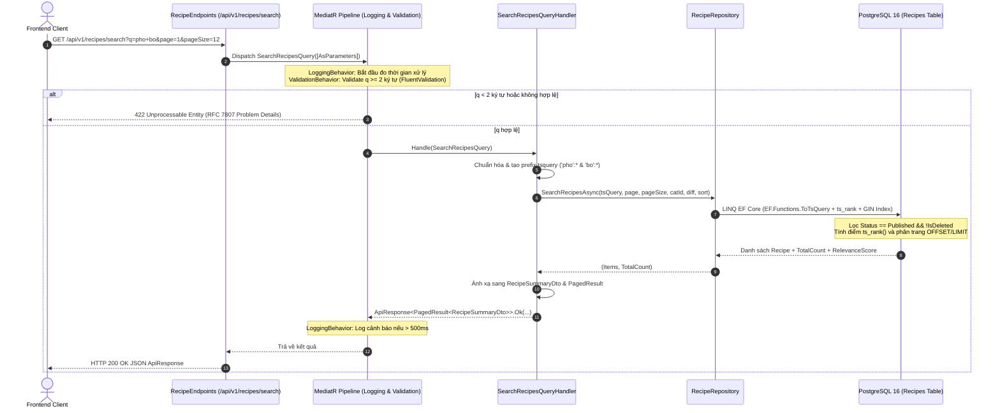

# Kế Hoạch Triển Khai API Tìm Kiếm Toàn Văn Bản (FR-SRCH-001)

Tài liệu này mô tả chi tiết kế hoạch kỹ thuật để xây dựng API Tìm kiếm Toàn văn bản (Full-Text Search - FTS) cho công thức nấu ăn dựa trên đặc tả tại [`FR-SRCH-001_Spec.md`](file:///d:/WebNangCao/PTUDWNC-2026-Nhom5/Culinary_Blog_Nhom5/docx/Spec/FR-SRCH-001_Spec.md), tuân thủ nghiêm ngặt mô hình Clean Architecture, CQRS, MediatR, FluentValidation, và cơ sở dữ liệu PostgreSQL 16.

---

## User Review Required

> [!IMPORTANT]
> **1. Bổ sung gói `Npgsql` vào `CulinaryBlog.Domain`:**  
> Để thuộc tính `Recipe.SearchVector` có kiểu dữ liệu strongly-typed `NpgsqlTsVector` trực tiếp trong Domain, ta cần thêm tham chiếu `<PackageReference Include="Npgsql" Version="10.0.3" />` vào `src/CulinaryBlog.Domain/CulinaryBlog.Domain.csproj`. Gói này chỉ chứa kiểu dữ liệu ADO.NET/PostgreSQL thuần, không chứa EF Core hay ASP.NET Core, đảm bảo tính trong sáng của Domain Layer.
> 
> **2. Migration mới `AddSearchVectorToRecipes`:**  
> Qua phân tích thư mục Migrations (`20260922024902_InitialCreate.cs`), database hiện tại đã có 2 extension `unaccent` và `pg_trgm`, nhưng bảng `Recipes` **chưa có cột `SearchVector`**, chưa có chỉ mục GIN và chưa có Trigger. Kế hoạch này sẽ bổ sung Migration mới `AddSearchVectorToRecipes` chứa SQL tạo cột, GIN Index và Trigger function tự động đồng bộ vector tiếng Việt không dấu.

---

## Kiến Trúc & Luồng Xử Lý



---

## Chi Tiết Các Tệp Sẽ Thay Đổi & Tạo Mới

### 1. Tầng Domain (`CulinaryBlog.Domain`)

#### [MODIFY] [CulinaryBlog.Domain.csproj](file:///d:/WebNangCao/PTUDWNC-2026-Nhom5/Culinary_Blog_Nhom5/src/CulinaryBlog.Domain/CulinaryBlog.Domain.csproj)
- Thêm package `Npgsql` (v10.0.3) để cung cấp kiểu dữ liệu `NpgsqlTsVector` cho `SearchVector`.

#### [MODIFY] [Recipe.cs](file:///d:/WebNangCao/PTUDWNC-2026-Nhom5/Culinary_Blog_Nhom5/src/CulinaryBlog.Domain/Entities/Recipe.cs)
- Bổ sung property `public NpgsqlTsVector? SearchVector { get; set; }` đại diện cho cột FTS tsvector.

#### [MODIFY] [IRecipeRepository.cs](file:///d:/WebNangCao/PTUDWNC-2026-Nhom5/Culinary_Blog_Nhom5/src/CulinaryBlog.Domain/Interfaces/IRecipeRepository.cs)
- Thêm chữ ký phương thức:
  ```csharp
  Task<(IReadOnlyList<RecipeSummaryDto> Items, int TotalCount)> SearchRecipesAsync(
      string sanitizedTsQuery,
      int page,
      int pageSize,
      Guid? categoryId = null,
      RecipeDifficulty? difficulty = null,
      string? sortBy = null,
      CancellationToken ct = default);
  ```

---

### 2. Tầng Infrastructure (`CulinaryBlog.Infrastructure`)

#### [MODIFY] [RecipeConfiguration.cs](file:///d:/WebNangCao/PTUDWNC-2026-Nhom5/Culinary_Blog_Nhom5/src/CulinaryBlog.Infrastructure/Persistence/Configurations/RecipeConfiguration.cs)
- Cấu hình Fluent API cho cột `SearchVector` và chỉ mục GIN:
  ```csharp
  builder.Property(r => r.SearchVector).HasColumnType("tsvector");
  builder.HasIndex(r => r.SearchVector).HasMethod("GIN").HasDatabaseName("IX_Recipes_SearchVector");
  ```

#### [NEW] [20260923120000_AddSearchVectorToRecipes.cs](file:///d:/WebNangCao/PTUDWNC-2026-Nhom5/Culinary_Blog_Nhom5/src/CulinaryBlog.Infrastructure/Persistence/Migrations/20260923120000_AddSearchVectorToRecipes.cs)
- Migration mới kế thừa `Migration`:
  - `Up`:
    1. Thêm cột `SearchVector` vào bảng `Recipes`.
    2. Tạo trigger function `recipes_search_vector_update()` (kết hợp `to_tsvector('simple', unaccent(...))` với trọng số `'A'` cho Title, `'B'` cho Description).
    3. Tạo trigger `trg_recipes_search_vector_update` kích hoạt `BEFORE INSERT OR UPDATE OF "Title", "Description" ON "Recipes"`.
    4. Tạo chỉ mục GIN `IX_Recipes_SearchVector`.
    5. Cập nhật dữ liệu vector cho toàn bộ các recipe đã có sẵn trong DB.
  - `Down`: Xóa trigger, function, GIN index và cột `SearchVector`.

#### [MODIFY] [RecipeRepository.cs](file:///d:/WebNangCao/PTUDWNC-2026-Nhom5/Culinary_Blog_Nhom5/src/CulinaryBlog.Infrastructure/Repositories/RecipeRepository.cs)
- Hiện thực hóa `SearchRecipesAsync(...)`:
  - Lọc `Status == RecipeStatus.Published && !IsDeleted`.
  - Khớp vector bằng `r.SearchVector!.Matches(EF.Functions.ToTsQuery("simple", sanitizedTsQuery))`.
  - Sắp xếp theo `r.SearchVector!.Rank(EF.Functions.ToTsQuery("simple", sanitizedTsQuery))` giảm dần (hoặc theo sort param).
  - Ánh xạ sang `RecipeSummaryDto` trực tiếp qua `.Select(...)` kèm tính toán `RelevanceScore` trong cùng 1 câu lệnh SQL tối ưu.

---

### 3. Tầng Application (`CulinaryBlog.Application`)

#### [NEW] [RecipeSummaryDto.cs](file:///d:/WebNangCao/PTUDWNC-2026-Nhom5/Culinary_Blog_Nhom5/src/CulinaryBlog.Application/DTOs/RecipeSummaryDto.cs)
- Định nghĩa DTO trả về kết quả tìm kiếm gồm: `Id`, `Title`, `Slug`, `Description`, `PrimaryImageUrl`, `Category` (`Id`, `Name`, `Slug`), `Author` (`Id`, `DisplayName`, `AvatarUrl`), `Difficulty`, `PrepTime`, `CookTime`, `Servings`, `RelevanceScore`, `CreatedAt`.

#### [NEW] [SearchRecipesQuery.cs](file:///d:/WebNangCao/PTUDWNC-2026-Nhom5/Culinary_Blog_Nhom5/src/CulinaryBlog.Application/Features/Recipes/Queries/SearchRecipes/SearchRecipesQuery.cs)
- Chứa:
  1. `SearchRecipesQuery`: record kế thừa `IRequest<ApiResponse<PagedResult<RecipeSummaryDto>>>`.
  2. `SearchRecipesQueryValidator`: FluentValidation kiểm tra `Q` không rỗng, tối thiểu 2 ký tự, tối đa 100 ký tự; `Page >= 1`; `PageSize` 1..50.
  3. `SearchRecipesQueryHandler`:
     - Tự động bỏ dấu tiếng Việt (unaccent/diacritics removal).
     - Tạo cú pháp prefix `tsquery` an toàn: `'pho':* & 'bo':*`.
     - Gọi `_unitOfWork.Recipes.SearchRecipesAsync(...)`.
     - Trả về `ApiResponse<PagedResult<RecipeSummaryDto>>.Ok(...)`.

---

### 4. Tầng Presentation (`CulinaryBlog.API`)

#### [MODIFY] [RecipeEndpoints.cs](file:///d:/WebNangCao/PTUDWNC-2026-Nhom5/Culinary_Blog_Nhom5/src/CulinaryBlog.API/Endpoints/RecipeEndpoints.cs)
- Đăng ký endpoint:
  ```csharp
  group.MapGet("/search", async (
      [AsParameters] SearchRecipesQuery query,
      ISender sender,
      CancellationToken ct) =>
  {
      var response = await sender.Send(query, ct);
      return Results.Ok(response);
  })
  .WithName("SearchRecipes")
  .WithSummary("Tìm kiếm toàn văn bản công thức nấu ăn (FR-SRCH-001)")
  .Produces<ApiResponse<PagedResult<RecipeSummaryDto>>>(StatusCodes.Status200OK)
  .Produces<ProblemDetails>(StatusCodes.Status422UnprocessableEntity);
  ```

---

## Kế Hoạch Xác Minh (Verification Plan)

### Automated Tests / Build
1. **Kiểm tra biên dịch dự án:**
   - Biên dịch toàn bộ Solution:
     ```powershell
     dotnet build d:\WebNangCao\PTUDWNC-2026-Nhom5\Culinary_Blog_Nhom5\CulinaryBlog.sln
     ```
   - Đảm bảo 0 lỗi (0 Errors).

### Manual / Integration Verification
1. **Chạy Migration & Khởi động Backend API:**
   - Kiểm tra `ApplicationDbContext.Database.MigrateAsync()` tự động chạy khi khởi động hoặc chạy lệnh migrate.
   - Kiểm tra bảng `Recipes` có cột `SearchVector`, GIN Index `IX_Recipes_SearchVector`, và trigger `trg_recipes_search_vector_update`.
2. **Kiểm thử tìm kiếm qua HTTP Request:**
   - **Kịch bản 1: Tìm kiếm tiếng Việt có dấu**  
     `GET http://localhost:5000/api/v1/recipes/search?q=phở`  
     Kỳ vọng: HTTP 200 OK, trả về danh sách các món phở, có `relevanceScore > 0`.
   - **Kịch bản 2: Tìm kiếm tiếng Việt không dấu**  
     `GET http://localhost:5000/api/v1/recipes/search?q=pho`  
     Kỳ vọng: HTTP 200 OK, trả về kết quả tương đương nhờ hàm `unaccent`.
   - **Kịch bản 3: Từ khóa ngắn (< 2 ký tự)**  
     `GET http://localhost:5000/api/v1/recipes/search?q=a`  
     Kỳ vọng: HTTP 422 Unprocessable Entity với RFC 7807 Problem Details bắt bởi `GlobalExceptionMiddleware`.
   - **Kịch bản 4: Ký tự đặc biệt**  
     `GET http://localhost:5000/api/v1/recipes/search?q=bò & | ! ;`  
     Kỳ vọng: HTTP 200 OK không bị lỗi cú pháp `tsquery` nhờ hàm làm sạch ký tự.
   - **Kịch bản 5: Lọc kết hợp danh mục và độ khó**  
     `GET http://localhost:5000/api/v1/recipes/search?q=bò&difficulty=Medium`  
     Kỳ vọng: Chỉ trả về các món khớp từ khóa và có độ khó `Medium`.
